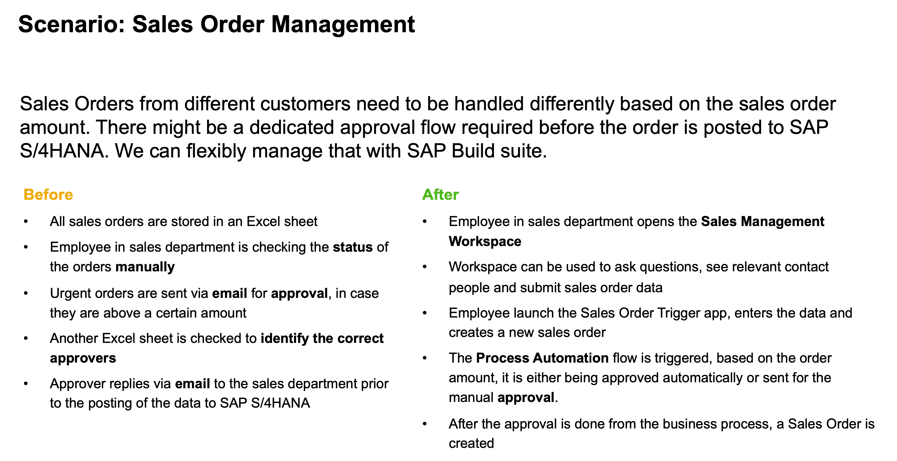
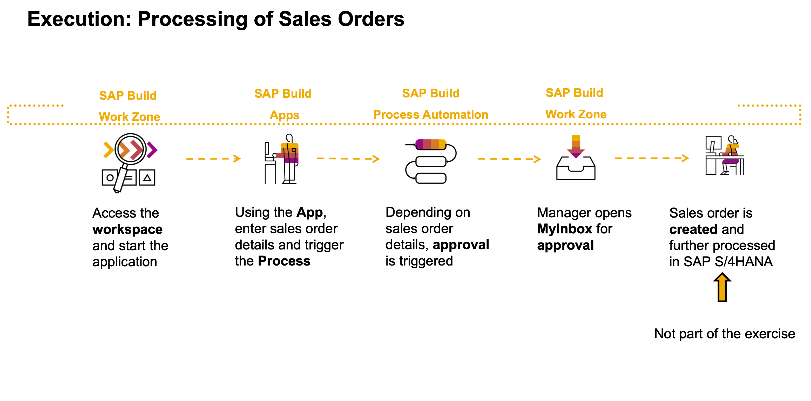

# AD180v - Create Apps, Processes, and Workspaces with SAP Build Solutions

## Description

This repository contains the material for the SAP TechEd 2023 session called **AD180v - Create Apps, Processes, and Workspaces with SAP Build Solutions**.

Learn how to accelerate development and automation without writing code. Experience how to leverage simple drag-and-drop capabilities to solve complex business problems and build delightful solutions. Extending or improving standard business process running in business solutions like SAP S/4HANA. 
The combination of SAP Build Process Automation, SAP Build Apps and SAP Build Work Zone makes the difference. 
Exercises can be completed at your own pace. 

## Overview

SAP Build provides solutions to extend and automate processes, create apps or design business sites. In this exercise you will leverage all of them together.

The scenario, a common use case, which you will find in almost every organization.

The exercises are belonging to each other, so please follow the flow accordingly.

## Requirements

Please use **Google Chrome browser** for the best experience.

The requirements to follow the exercises in this repository are trial access to all three products.
Please **follow the steps for each product**, as described in the following exercises and **also following the order**:
1. Setup [SAP Build Apps](exercises/0_Setup_Trial_Landscape/1_build-apps-trial-booster/build-apps-trial-booster.md) (5 minutes)
2. Setup [SAP Build Work Zone](exercises/0_Setup_Trial_Landscape/2_cp-portal-cloud-foundry-getting-started/cp-portal-cloud-foundry-getting-started.md) (5 minutes)
3. Setup [SAP Build Process Automation](exercises/0_Setup_Trial_Landscape/3_spa-subscribe-free-trial/spa-subscribe-free-trial.md) (5 minutes)

>Hint: It is also possible to follow the exercise in your own productive environment.

## Exercises

- **Exercise 1 - Create a Sales Order Process with SAP Build Process Automation** (60 minutes)
    - [Exercise 1.1 - Create Sales Order Business Process](exercises/1_Build_Process_Automation/1_1_spa-academy-salesorder/spa-academy-salesorder.md)
    - [Exercise 1.2 - Run the Sales Order Business Process](exercises/1_Build_Process_Automation/1_2_spa-academy-run-salesorderprocess/spa-academy-run-salesorderprocess.md)
  
- **Exercise 2 - Create a Sales Order App with SAP Build Apps** (45 minutes)
    - [Exercise 2.1 - Create Destination to Trigger Process from any Service](exercises/2_Build_Apps/1_spa-create-service-instance-destination/spa-create-service-instance-destination.md)
    - [Exercise 2.2 - Create an app in SAP Build App to trigger Process](exercises/2_Build_Apps/2_build-apps-workflow-trigger/build-apps-workflow-trigger.md)
    - [Exercise 2.3 - Deploy SAP Build App to SAP BTP](exercises/2_Build_Apps/3_build-apps-deploy/build-apps-deply.md)
  
- **Exercise 3 - Create a Business Site with SAP Build Work Zone, standard edition** (45 minutes)
    - [Exercise 3.1 - Create a Site Using SAP Build Work Zone, standard edition](exercises/3_Build_Work_Zone/1_Create_a_Site_Using_SAP_Build_Work_Zone/Create_a_Site_Using_SAP_Build_Work_Zone.md)
    - [Exercise 3.2 - Integrate an SAP Build Apps application into SAP Build Work Zone, standard edition](exercises/3_Build_Work_Zone/2_Integrate_an_SAP_Build_Apps_application_into_SAPBuildWorkZone/workzone-build-sales-app.md)
    - [Exercise 3.3 - Add My Inbox from SAP Build Process Automation to SAP Build Work Zone](exercises/3_Build_Work_Zone/3_spa-configure-workzone/AddMyInboxWZ.md)
    - [Exercise 3.4 - Design Your Site With the New SAP Build Work Zone Experience](exercises/3_Build_Work_Zone/4_Design_Your_Site_With_the_New_SAP_Build_Work_Zone_Experience/cp-portal-cloud-foundry-spaces-pages.md)
    - [Exercise 3.5 - Experience the End-to-End Flow](exercises/3_Build_Work_Zone/5_EndtoEndRun/Run.md)

With the last exercise, you will experience the following flow:

## Contributing
Please read the [CONTRIBUTING.md](./CONTRIBUTING.md) to understand the contribution guidelines.

## Code of Conduct
Please read the [SAP Open Source Code of Conduct](https://github.com/SAP-samples/.github/blob/main/CODE_OF_CONDUCT.md).

## How to obtain support

Support for the content in this repository is available during the actual time of the online session for which this content has been designed. Otherwise, you may request support via the [Issues](../../issues) tab.

## License
Copyright (c) 2023 SAP SE or an SAP affiliate company. All rights reserved. This project is licensed under the Apache Software License, version 2.0 except as noted otherwise in the [LICENSE](LICENSES/Apache-2.0.txt) file.
