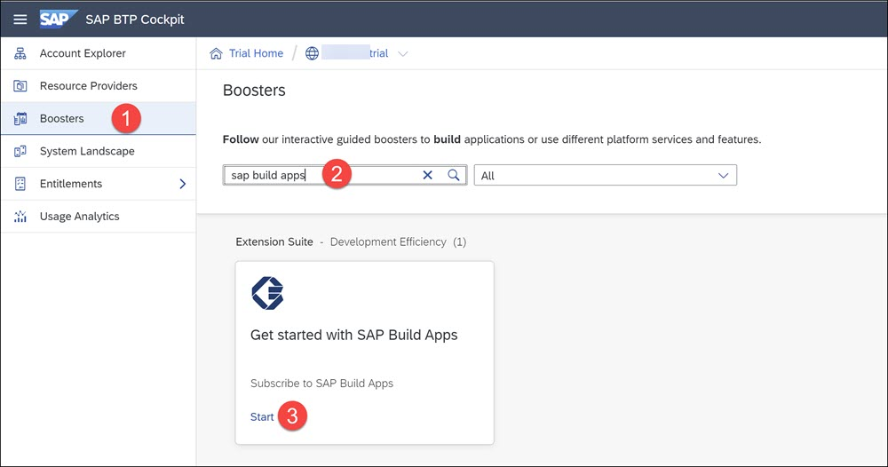
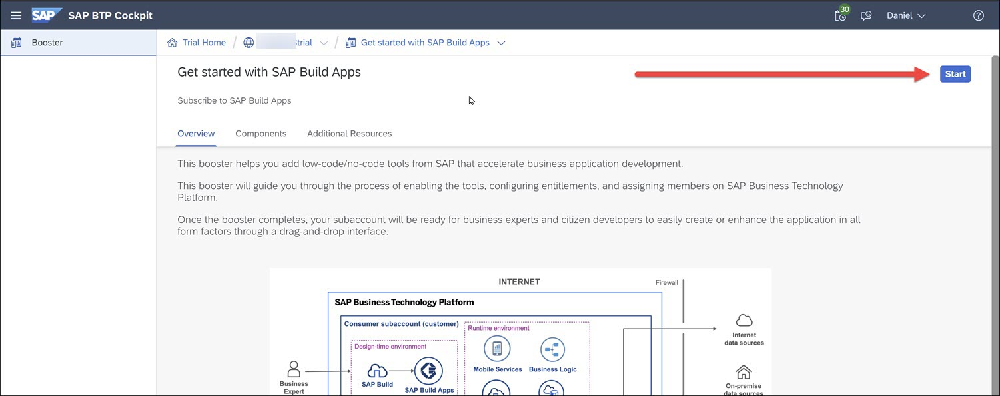
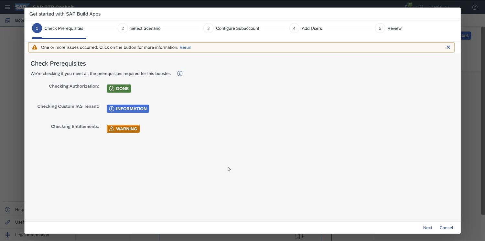
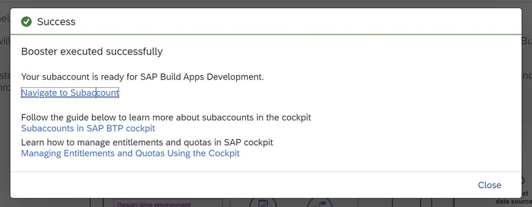
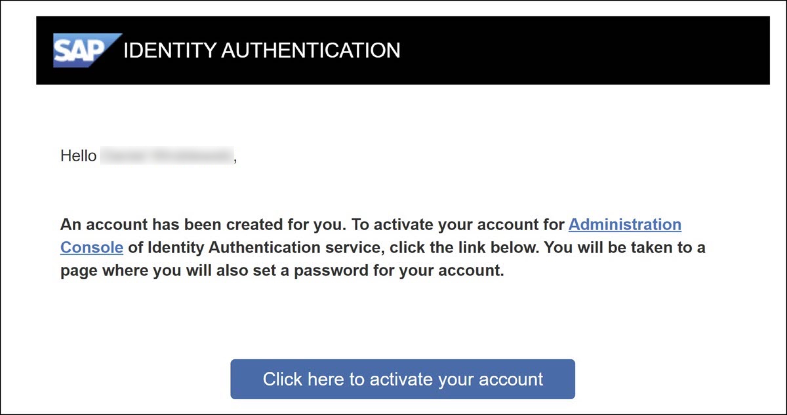
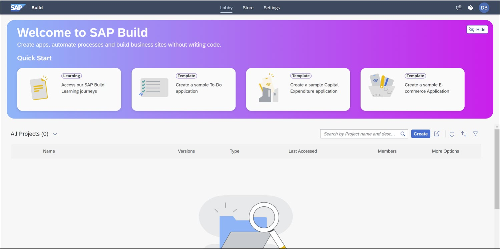

# Set Up SAP Build Apps (with Booster) on SAP BTP Trial Account
<!-- description --> Set Up SAP Build Apps on an SAP BTP trial account, using the SAP Build Apps booster.

## Prerequisites
- You have created a trial account, as described in [Get a Free Account on SAP BTP Trial](https://developers.sap.com/tutorials/hcp-create-trial-account.html).
- Your trial account must be in the **US East (VA) - AWS**.

## You will learn
- How to set up SAP Build Apps on your trial account

## Intro

### Run the SAP Build Apps Booster
SAP BTP offers a booster that automatically sets up all the things you need to start using SAP Build Apps, including:

- SAP Build Apps
- Roles
- Cloud Identity Service
- Trust between custom identity provider and your subaccount

1. Go to your global account.

2. Select **Boosters**, search for `sap build apps`, and click the booster tile.

    

3. Click **Start**.

    

4. The booster will check your entitlements, and likely will give a warning. You can ignore these.
    
    

    Click **Next** (bottom right).

5. Select **Select Subaccount**, and click **Next**.

    >You will not be able to select **Create Subaccount** because your trial global account is limited to one subaccount, unless you deleted the subaccount automatically created when you created your trial account.

6. The booster will automatically select the one subaccount, so there is nothing to do on the **Configure subaccount** screen.

    Click **Next**.

7. On the **Add Users** screen, you are automatically giving the appropriate roles so there is nothing to do here.

    Click **Next**.

9. On the **Review** screen, click **Finish**.

When everything is installed, you will see the following:

### Create password for new identity provider
SAP Build Apps requires that users be part of a custom identity provider, and to log in to SAP Build Apps using this identity provider.

One of things the booster did was to create a new identity provider for you. But you will have to activate your user on that identity provider.

After running the booster, you will get an email to activate your account on this new identity provide.

Click the button to activate your account, and follow the instructions for creating a password for this new custom identity provider. 

When you are done you will see a new browser tab with the administration UI for managing users and authorizations for this identity provider. There is nothing to be done on this screen.

### Open SAP Build Apps
In the cockpit of your subaccount, go to **Services and Instances**.

Click on **SAP Build Apps** (or the little icon) to view the SAP Build lobby.

You should now see SAP Build Apps.

>In subsequent logins, you may be presented with 2 identity providers to log in with. SAP Build Apps requires the custom identity provider, so select the identity provider that is NOT **Default identity provider**.

>When you do login to SAP Build Apps, use your password that you created for the custom identity provider.

>
