# Subscribe to SAP Build Process Automation Using Booster in SAP BTP Free Trial
<!-- description --> Activate the SAP Build Process Automation service in the SAP BTP with Booster

## Prerequisites
  - [Get an Account on SAP BTP to Try Out Free Tier Service Plans](btp-free-tier-account) 

## You will learn
  - How to activate SAP Build Process Automation in SAP BTP Free Trial account

## Intro
SAP Build Process Automation in the SAP Business Technology Platform combines the capabilities of SAP Workflow Management and SAP Intelligent RPA in an easy-to-use, no-code AI-powered experience. It increases organizations' capacity to drive process automation by empowering business experts to become citizen developers. Leveraging the power of no-code, citizen developers can build, adapt, improve, and innovate business processes with minimum assistance from scarce IT resources.

---

### Subscribe to SAP Build Process Automation Booster

1. After successful creation of SAP BTP account using Free Trial, navigate to Boosters and search for **free** to find the **SAP Build Process Automation** booster. Once the tile is shown, select the tile.

    > Booster is a guided set of automatic instructions to achieve a specific goal. SAP Build Process Automation automates the onboarding of SAP Build Process Automation service in your account without the need of any manual configurations. It will configure entitlement, enable SAP Build Process Automation subscription, and will assign all the relevant role collections to the given users for administrator or developer personas.

    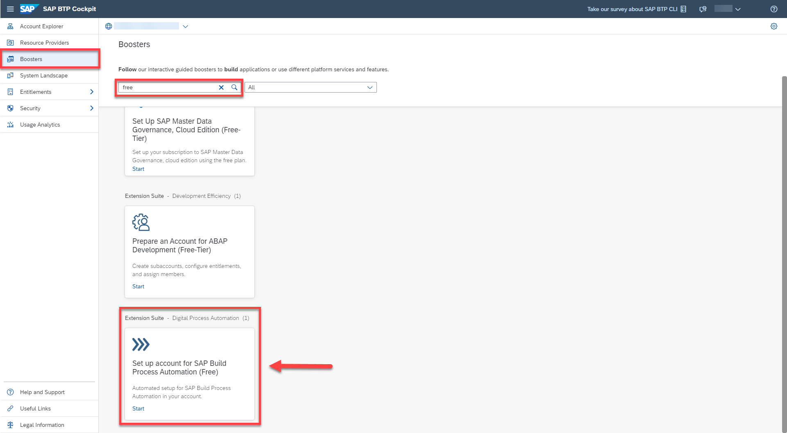

2. You will be navigated to the overview page of the booster. Choose **Start**.

    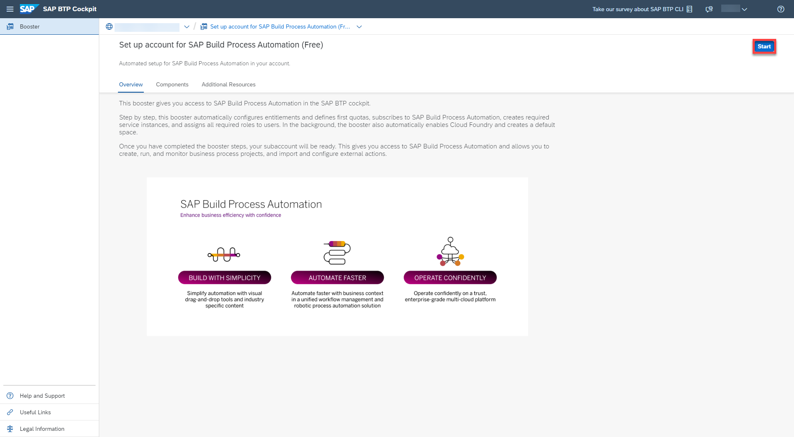

3.  The booster tests the prerequisites for the service and your credentials. Once the **Prerequisites** are marked as **DONE** in green, it indicates that the tests have passed successfully. Choose **Next**.

    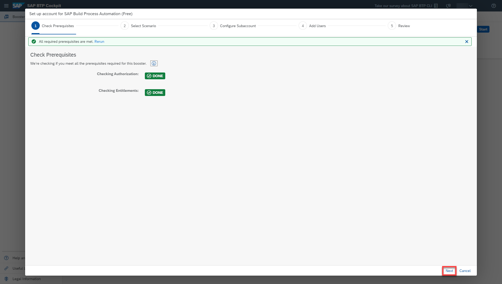

4. In this step you can create a new sub-account or use an existing one. Here, you will create a new sub-account scenario and choose **Next**.

    > You cannot have SAP Build Process Automation and SAP Intelligent RPA in the same sub-account.

    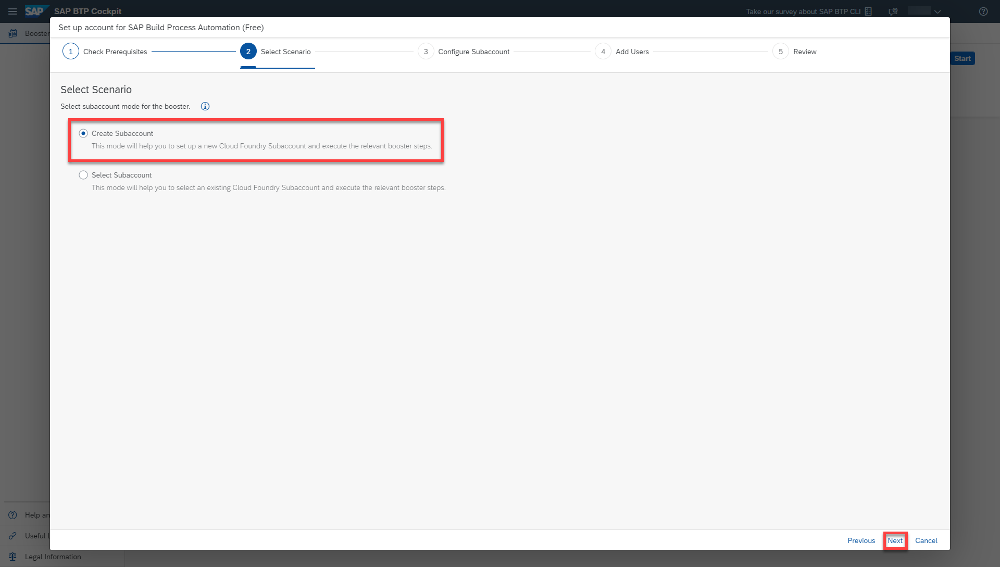

5. System shows you all generated IDs which can be changed or accepted. The most important point here is that you can see the correct service and plan in the box then choose **Next**.

    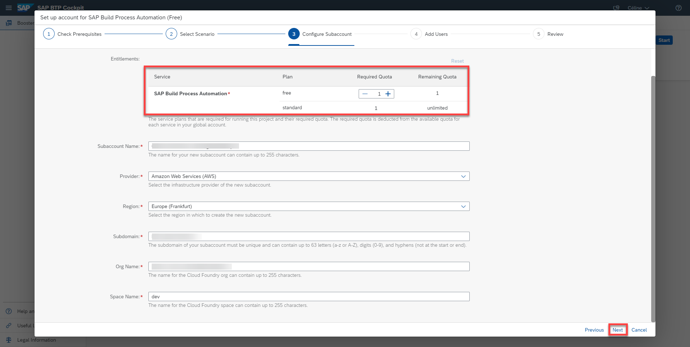

6. Maintain users that would be added to the SAP Build Process Automation service. The users can be added later too. Choose **Next**.

    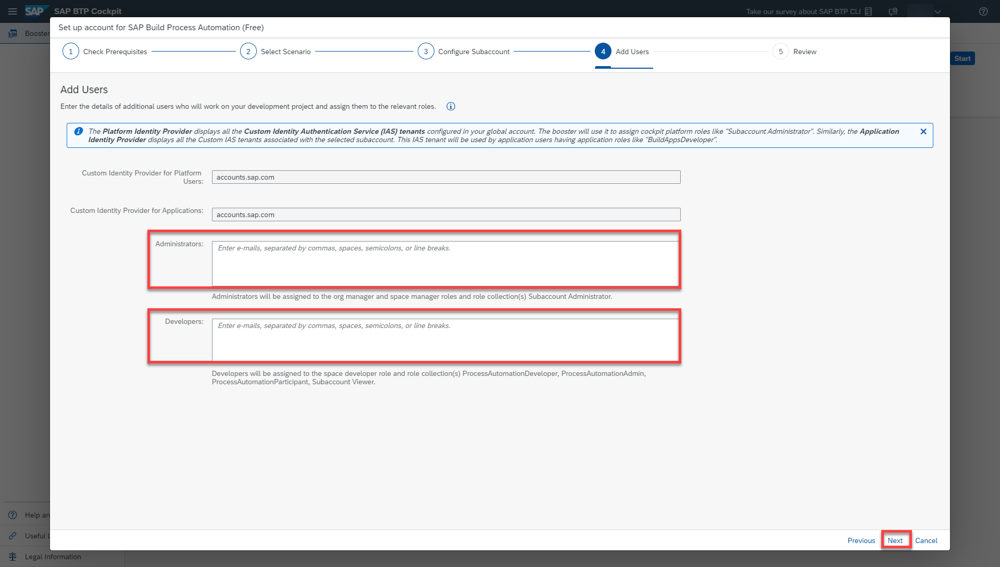

7. Summary of the booster is shown in the last page for review. After the review, choose **Finish**.

    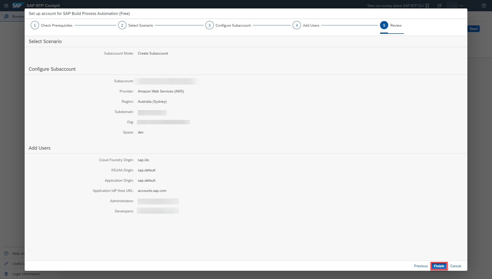  

8. The booster starts the deployment which can take up to five minutes to get the service ready.

    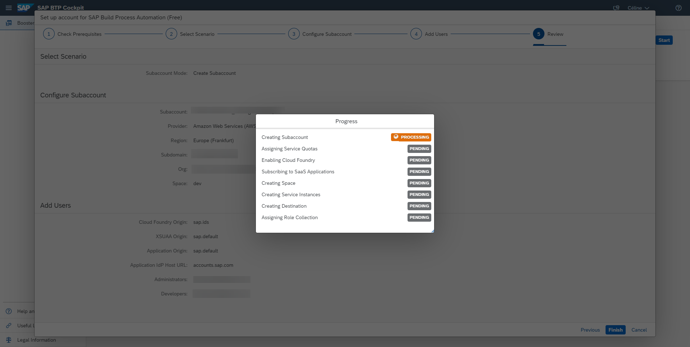

    A pop-up will inform you that the Booster was successfully executed.

9. Choose **Navigate to Subaccount**.

    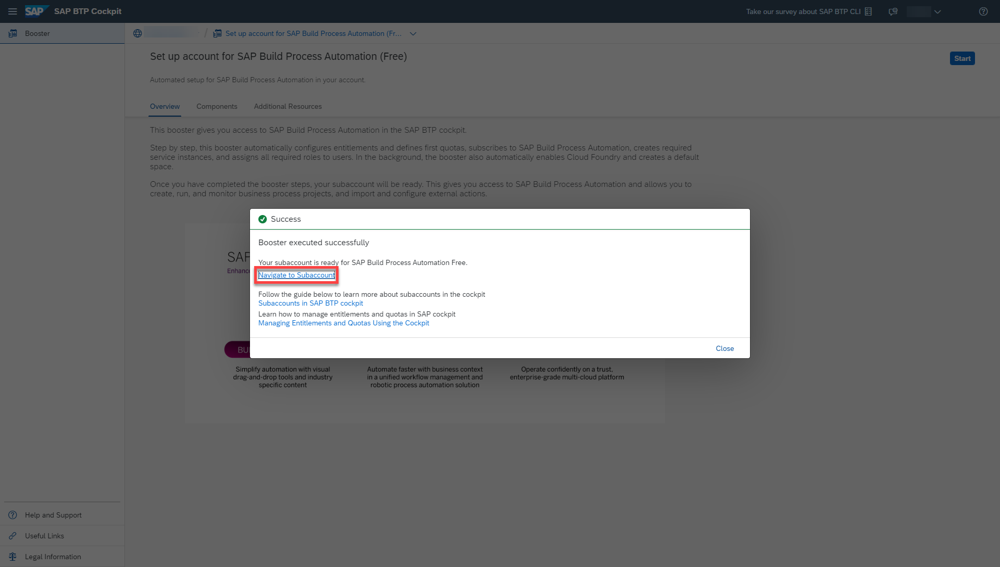

10. Then choose **Instances and Subscriptions** in the menu.

    You now get an overview on the activated services and you can move directly to the **SAP Build Process Automation** application by selecting the icon.

    > SAP Build Process Automation Application Development workbench which will be your one-stop studio to develop, test, deploy and monitor your processes with different skills like decision, automation, forms etc.

    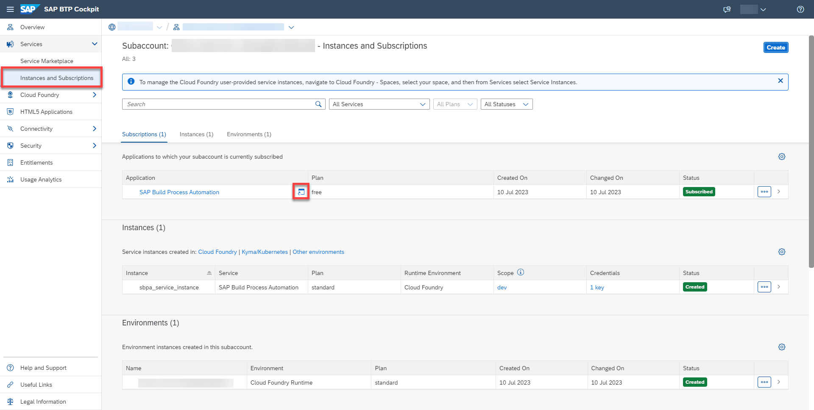

11. You will have access to SAP Build which is a no-code environment from where you can start your development of the business processes.

    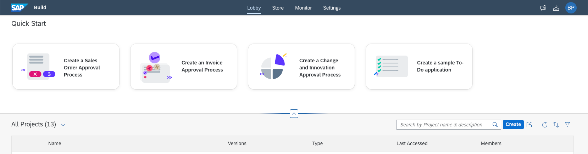

    Your are now ready to use SAP Build Process Automation in SAP BTP Free Trial.

---
**Congratulations**, you have now finalized the setup of all three SAP Build products and ready to do the exercises.

## Next Step
Start with the [creation of sales order business process](/exercises/1_Build_Process_Automation/1_1_spa-academy-salesorder/spa-academy-salesorder.md) in SAP Build Process Automation.