# Subscribe to SAP Build Process Automation Using SAP BTP Free Trial
<!-- description --> Activate SAP Build Process Automation service in SAP BTP Free Trial

## Prerequisites
- You have created a trial account, as described in [Get a Free Account on SAP BTP Trial](https://developers.sap.com/tutorials/hcp-create-trial-account.html).
- Your trial account must be in the **US East (VA) - AWS**.

## You will learn
  - How to activate SAP Build Process Automation in SAP BTP Free Trial account

## Intro
SAP Build Process Automation in the SAP Business Technology Platform combines the capabilities of SAP Workflow Management and SAP Intelligent RPA in an easy-to-use, no-code AI-powered experience. It increases organizations' capacity to drive process automation by empowering business experts to become citizen developers. Leveraging the power of no-code, citizen developers can build, adapt, improve, and innovate business processes with minimum assistance from scarce IT resources.

---

### Subscribe to SAP Build Process Automation

**IMPORTANT**: In case you cannot see SAP Build Process Automation in Service Marketplace, please use the option **"[Using Entitlements](/exercises/0_Setup_Trial_Landscape/3_spa-subscribe-free-trial/spa-subscribe-free-trial.md#using-entitlements)"** below.

### Using Service Marketplace

1. After successful creation of SAP BTP account using Free Trial, select **Services**> **Service Marketplace**. In the search field, type **SAP Build Process Automation** and select the tile.

    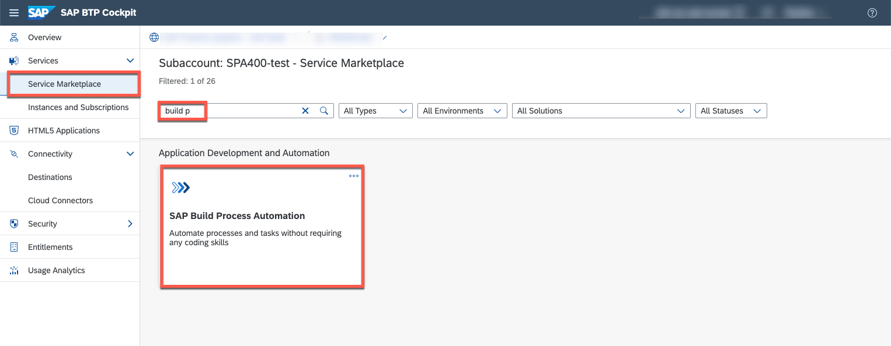

2. Choose **Create** button.

    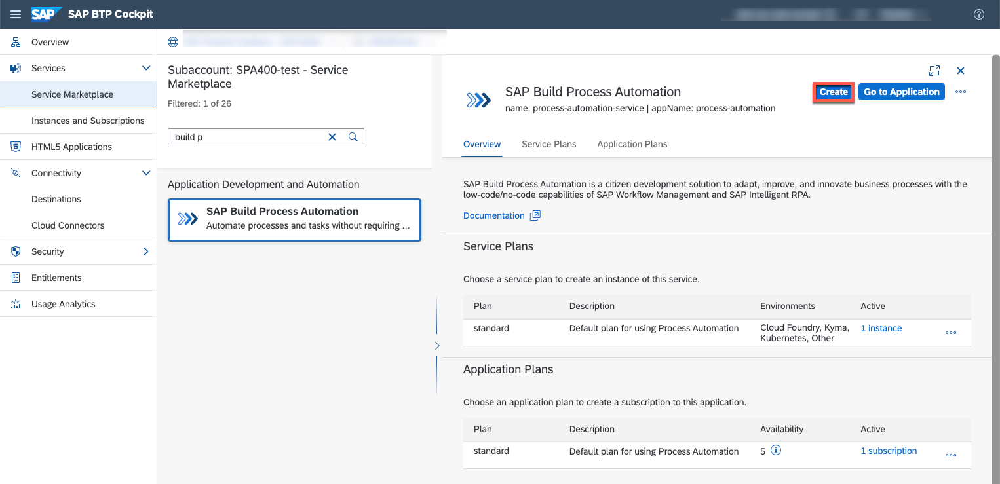

3.  In the **New Instance or Subscription** window, choose the **free subscription** plan and select **Create** button.

    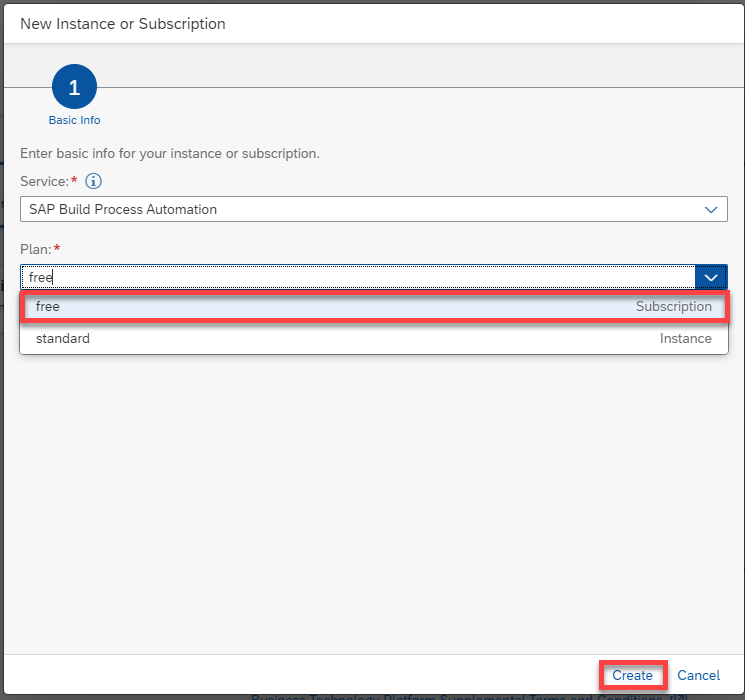

4. In the **Creation in Progress** pop-up, select **View Subscription**.

    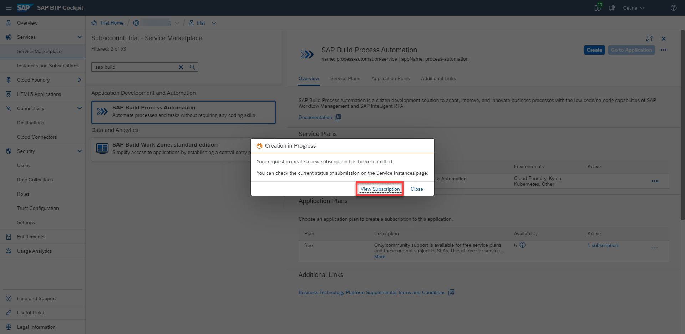

5. Check if it is processed and created successfully. The status should be set to **Subscribed**.

    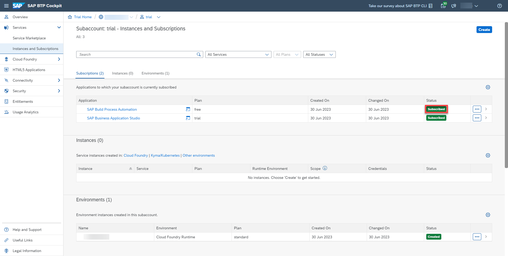

### Using Entitlements 

1. Select **Entitlements**. Choose **Configure Entitlements**. 

    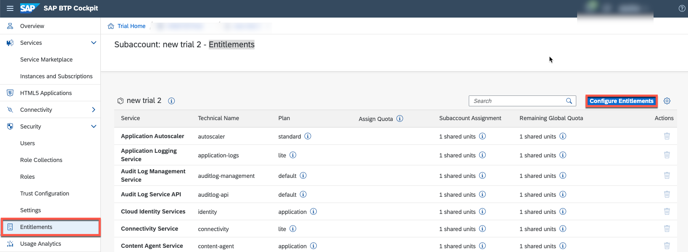

2. Select **Add Service Plans**.

    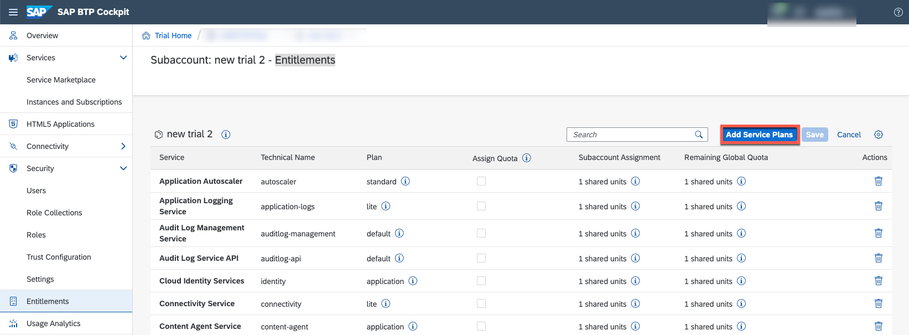

3. Look for **SAP Build Process Automation** Entitlement. Select **free** plan. Click on **Add Service Plans**.

    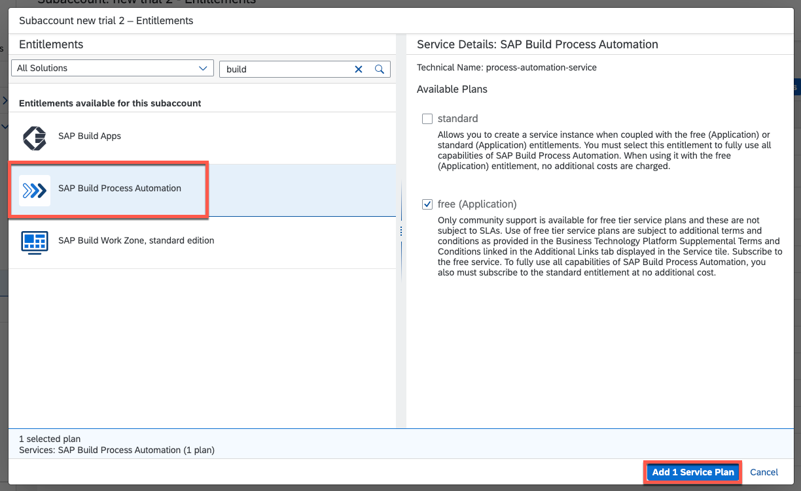

### Assign Roles

In order to have access, you will have to assign the role collections to your user and the newly created identity provider for SAP Build Apps, which you have created before. 
   
2. Go to the **Users**, under **Security**, and select your user.

3. In **Role Collections** section, choose **Assign Role Collection**.

    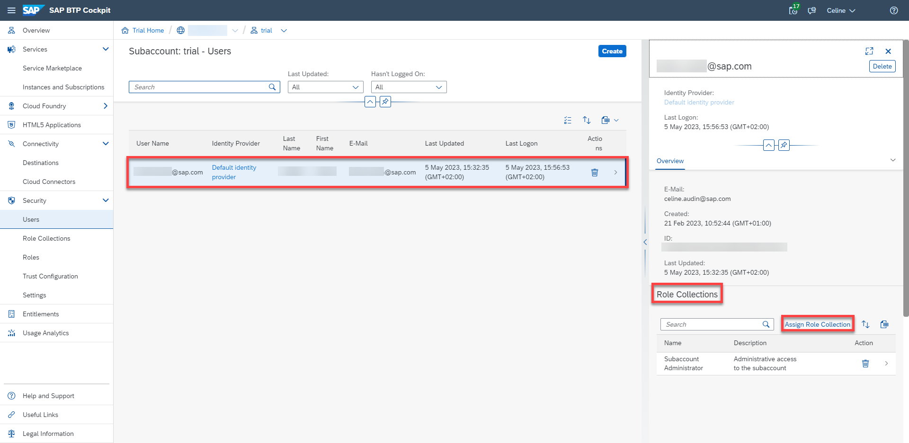

4. In the **Assign Role Collection** window, in the search bar, type **process** to find Process Automation Roles.

5. Select 3 roles: `ProcessAutomationAdmin`, `ProcessAutomationDeveloper` and `ProcessAutomationParticipant`.

6. Choose **Assign Role Collection** button.

    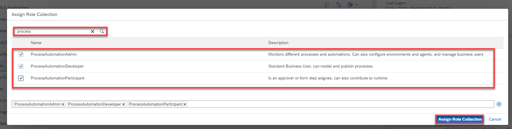   

7. After assigning roles, your **Role Collections** section should look like this:

    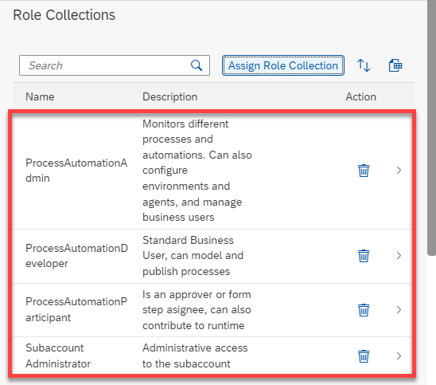

**Repeat these steps for the newly created identity provider and also assign the same role collections.**
Then you should have this result:

   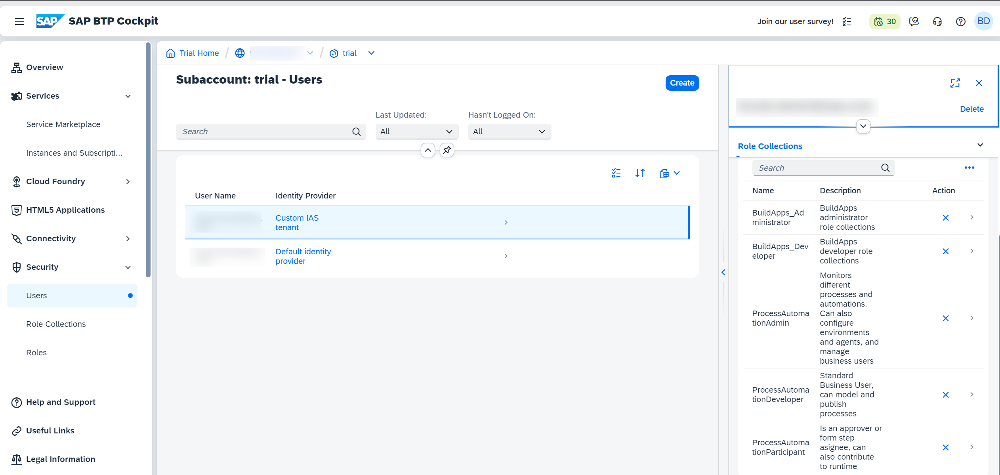

8. Navigate to **Instances and Subscriptions** and choose the **Go to Application** icon.

    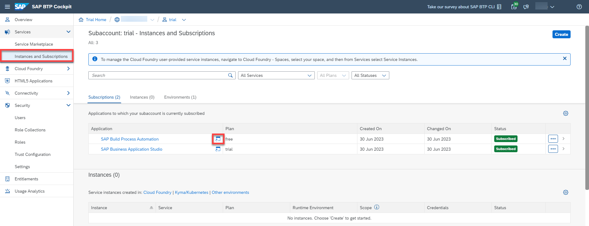

    This will launch your SAP Build Process Automation application.

    You have successfully subscribed to SAP Build Process Automation.
   

---
**Congratulations**, you have now finalized the setup of all three SAP Build products and ready to do the exercises.

## Next Step
Start with the [creation of sales order business process](/exercises/1_Build_Process_Automation/1_1_spa-academy-salesorder/spa-academy-salesorder.md) in SAP Build Process Automation.