# Subscribe to SAP Build Process Automation Using SAP BTP Free Trial
<!-- description --> Activate SAP Build Process Automation service in SAP BTP Free Trial

## Prerequisites
  - Complete [Get a Free Account on SAP BTP Trial tutorial](hcp-create-trial-account)
    > **IMPORTANT**: CREATE AN ACCOUNT IN US East (VA) - AWS trial region

## You will learn
  - How to activate SAP Build Process Automation in SAP BTP Free Trial account

## Intro
SAP Build Process Automation in the SAP Business Technology Platform combines the capabilities of SAP Workflow Management and SAP Intelligent RPA in an easy-to-use, no-code AI-powered experience. It increases organizations' capacity to drive process automation by empowering business experts to become citizen developers. Leveraging the power of no-code, citizen developers can build, adapt, improve, and innovate business processes with minimum assistance from scarce IT resources.

---

### Subscribe to SAP Build Process Automation

**IMPORTANT**: In case you cannot see SAP Build Process Automation in Service Marketplace, please use the option **Using Entitlements** above in the tab.

[OPTION BEGIN [Using Service Marketplace]]

1. After successful creation of SAP BTP account using Free Trial, select **Services**> **Service Marketplace**. In the search field, type **SAP Build Process Automation** and select the tile.

    <!-- border -->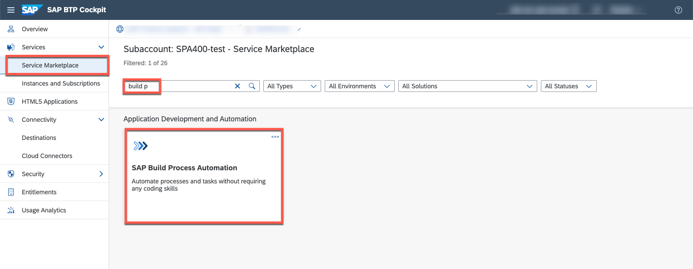

2. Choose **Create** button.

    <!-- border -->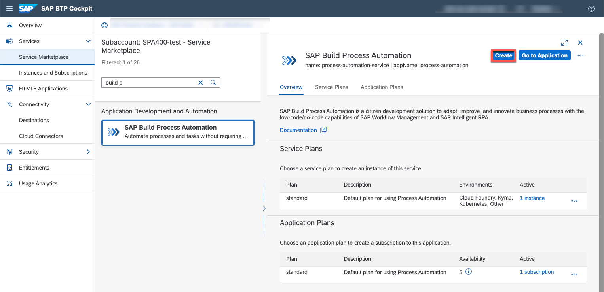

3.  In the **New Instance or Subscription** window, choose the **free subscription** plan and select **Create** button.

    <!-- border -->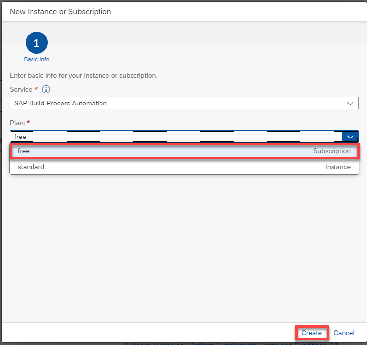

4. In the **Creation in Progress** pop-up, select **View Subscription**.

    <!-- border -->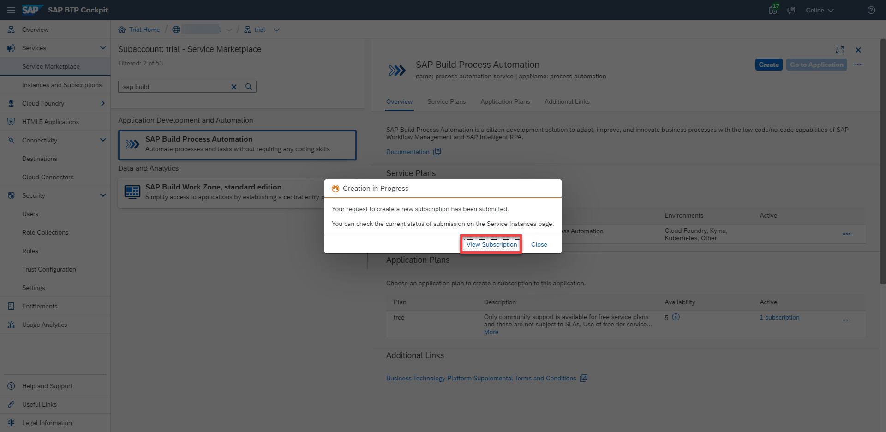

5. Check if it is processed and created successfully. The status should be set to **Subscribed**.

    <!-- border -->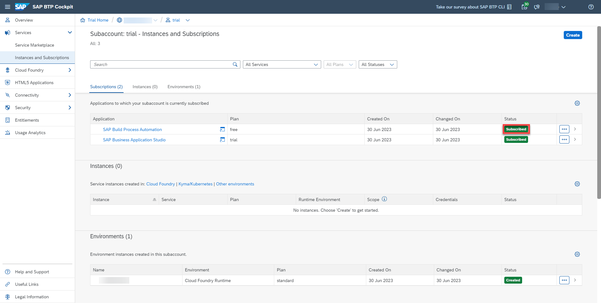

[OPTION END]

[OPTION BEGIN [Using Entitlements]]

1. Select **Entitlements**. Choose **Configure Entitlements**. 

    <!-- border -->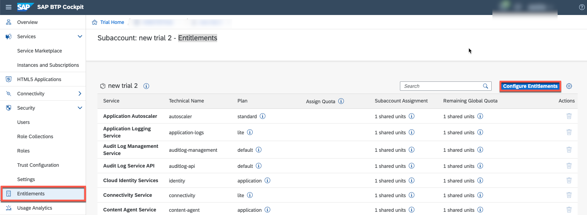

2. Select **Add Service Plans**.

    <!-- border -->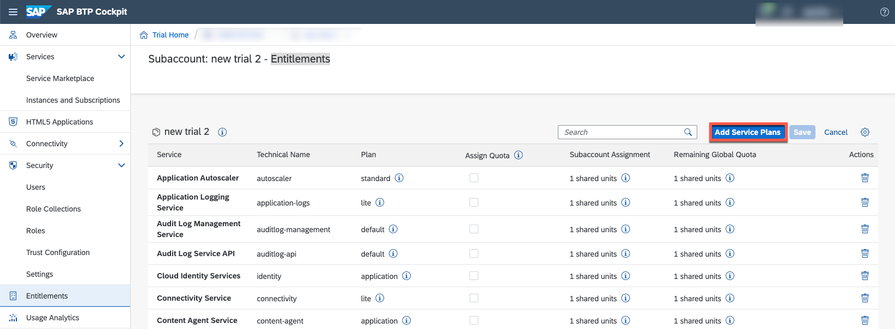

3. Look for **SAP Build Process Automation** Entitlement. Select **free** plan. Click on **Add Service Plans**.

    <!-- border -->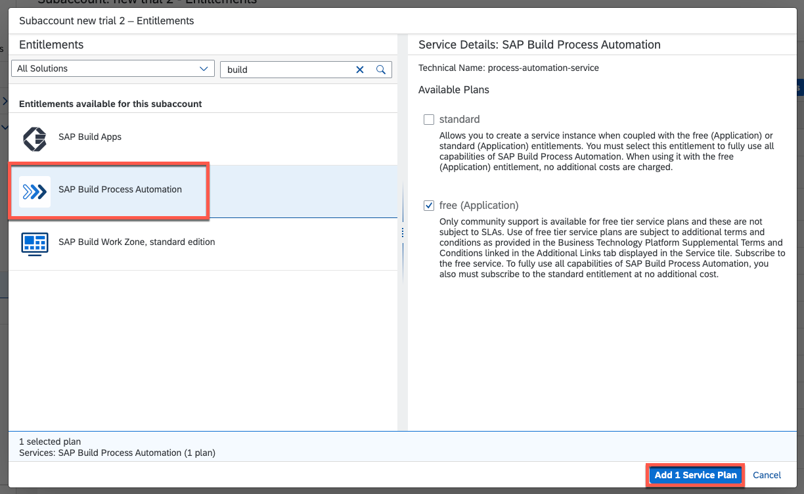

[OPTION END]

### Assign Roles

In order to have access, you will have to assign the role collections to your user. 
   
2. Go to the **Users**, under **Security**, and select your user.

3. In **Role Collections** section, choose **Assign Role Collection**.

    <!-- border -->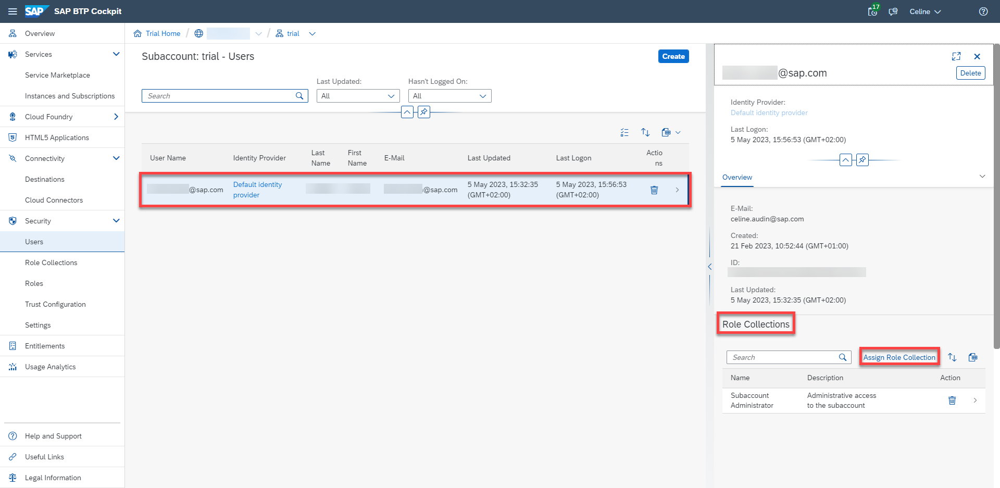

4. In the **Assign Role Collection** window, in the search bar, type **process** to find Process Automation Roles.

5. Select 3 roles: `ProcessAutomationAdmin`, `ProcessAutomationDeveloper` and `ProcessAutomationParticipant`.

6. Choose **Assign Role Collection** button.

     <!-- border -->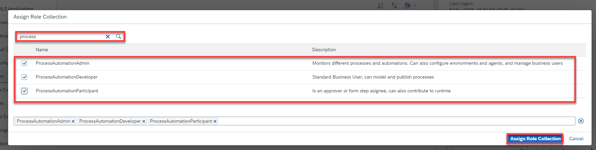   

7. After assigning roles, your **Role Collections** section should look like this:

    <!-- border -->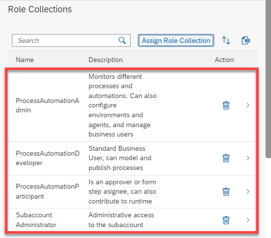

8. Navigate to **Instances and Subscriptions** and choose the **Go to Application** icon.

    <!-- border -->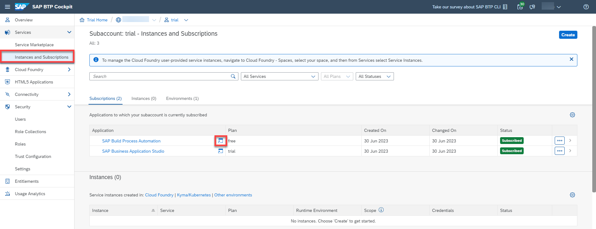

    This will launch your SAP Build Process Automation application.

    You have successfully subscribed to SAP Build Process Automation.
   

---
