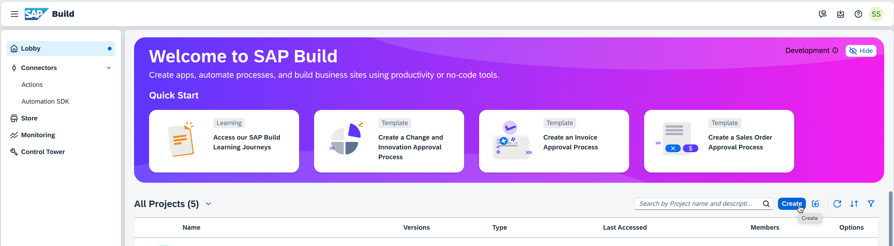
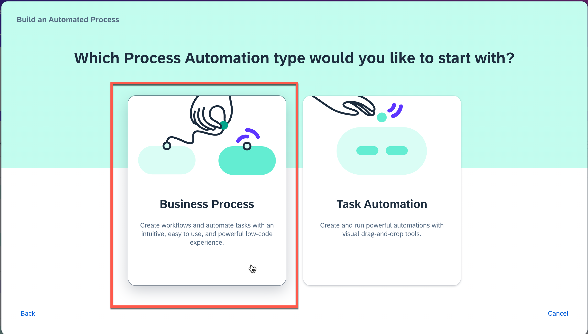
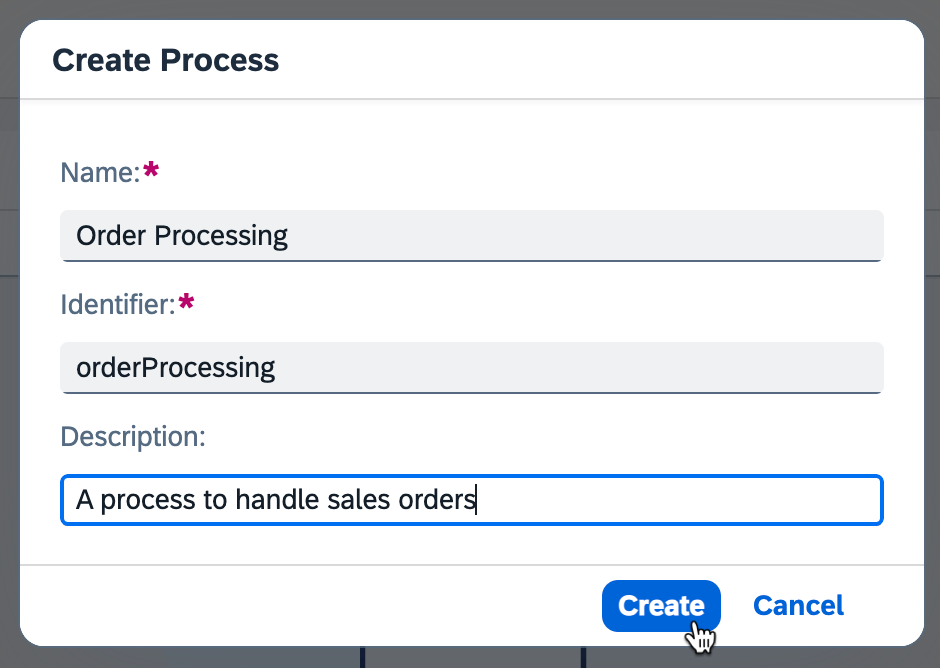
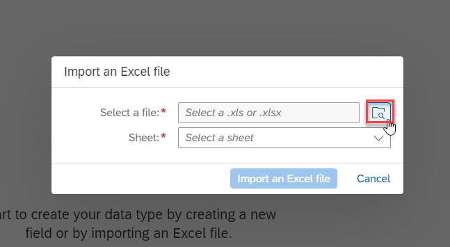
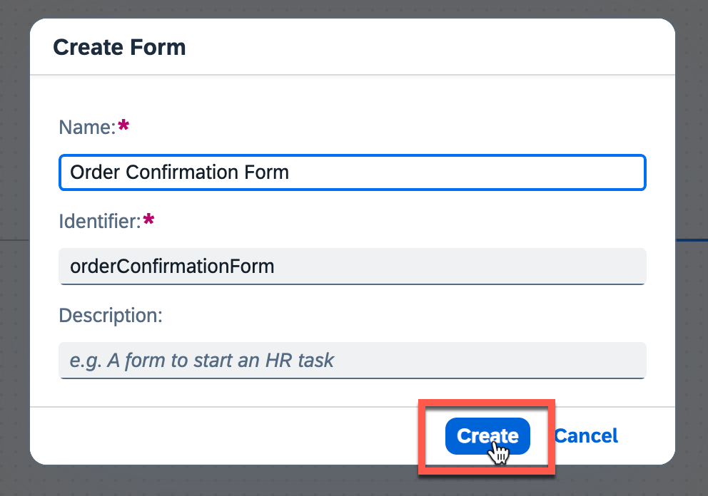
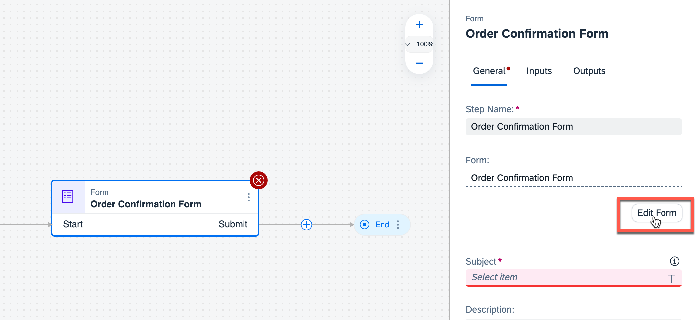
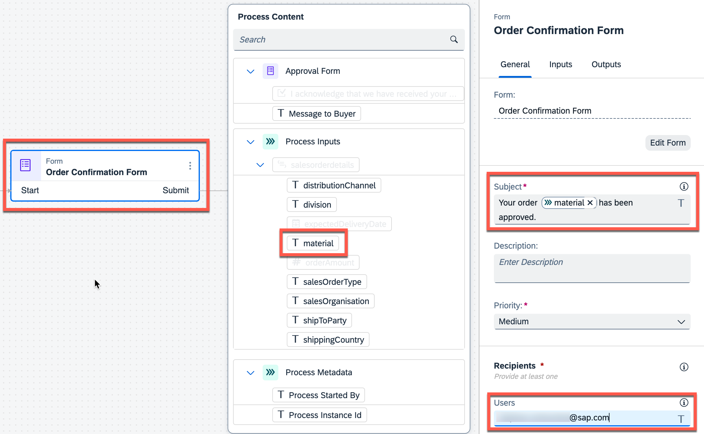
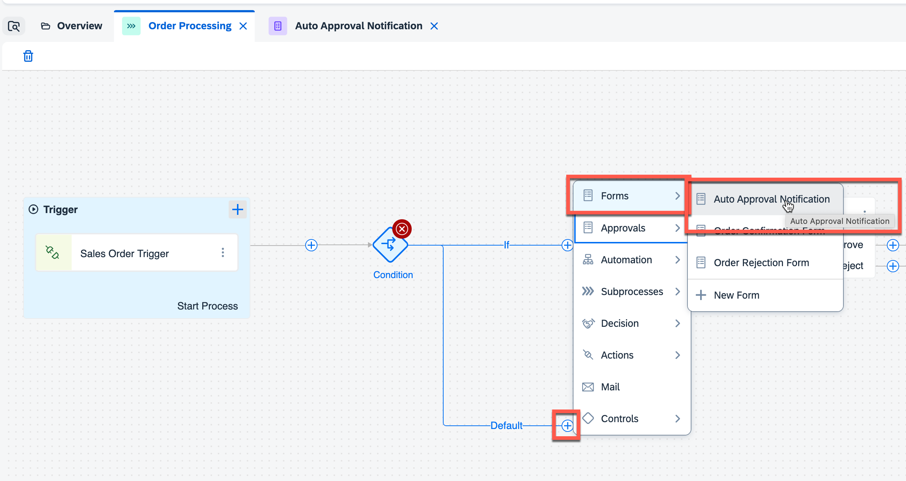

# Create Sales Order Business Process
<!-- description --> Create a business project and process to build and extend business processes.

## Prerequisites 
  - A SAP BTP Trial account, please follow [Subscribe to SAP Build Process Automation Using SAP BTP Free Trial Booster](/exercises/0_Setup_Trial_Landscape/3_spa-subscribe-booster/spa-subscribe-booster.md)

## You will learn
  - How to create a SAP Build Process Automation project.
  - How to create a process that automates sales order creation and approval.
  - How to create an API trigger to integrate with any applications like SAP Build Apps, CAP etc.

---

## Intro
With the new citizen automation user experience, you will get access to a new scope of opportunities for running your day-to-day workflows. In this tutorial, you will learn how a low-code and no-code tool can help you build the business process you need at the speed your business demands, using visual drag-and-drop tools for application development.

There are many use cases where you can make a difference using SAP Build Process Automation. During this tutorial, you will see how the Sales Order Approval process can be built using forms where a sales order is a document which confirms a sale that is generated by the seller after receiving a purchase order from the buyer. These sale order requests have to be reviewed and approved by the supplier to ensure that the sales orders are delivered on time. Once approved or rejected, the requester will be notified.

---

### Create a business process project

1. In the **Lobby**, choose **Create**.

    > The lobby is a central page for creating, accessing, and managing your projects in SAP Build. You can access business application processes, company configured templates, and other resources for your end-to-end business process.

     

2. Pick **Build an Automated Process**.

     

3. Select **Business Process**.

    > Business Process Projects are a collection of skills in SAP Build Process Automation. Projects are part of the internal business processes of a company and are defined based on business scenarios. A project can contain a set of processes, forms, automations and decisions, which are reusable artifacts.

     

4. In the **Create a Business Process** dialog box, do the following:

    - Enter a **Project Name** that starts with `Sales Orders Management`. In workshops, we recommend using the user identifier and then your initials, something like this: `Sales Orders Management_001_JFK`.

        >Tip: Always use a name that would help users distinguish your workspace from others.

    - Enter a **Short Description**: Sales Orders Management Project.

         

    - Choose **Create**.

### Create a business process

Once you have successfully created a Business Process Project, you will create a Business Process to automate the Sales Order Approval Process.

1. A new tabs opens with the newly created project.

2. In the **Create Process** dialog box, provide the following:

    - Enter a **Name**: Order Processing.
    - Enter a **Description** for your process: A process to handle sales orders.
    - Choose **Create**.

    > Inside a project, you can create a process. This process is equivalent to a workflow in any business scenario. You can create this process from different skills such as forms, decisions, automations.

    

    > The form **Identifier** field is auto-filled.

  3. You are navigated to the Process Builder canvas.

     This is a visual canvas on which you map out your business process from start to finish. Other process artifacts are then added to this canvas, with process controls and connectors used to decide how information flows when the process is running.

In the next step, you will create a data type which would be used to integrate with SAP Build Apps and SAP Build Process Automation.   

### Create a Data Type

A data type is an artifact describing a data structure that can be used as an input and/or output parameter in automations or processes.

You have two options to create the fields in data type. You can either import an excel file or define the fields manually.

#### Import Excel File (Option 1)

In this option, you will be importing an excel file to create the data type. Based on the values present in the excel, the type of field is determined automatically and the fields are created accordingly. For example `orderAmount` is maintained as 19000, hence the type of the field `orderAmount` is determined as Number.

1.  Download [this](exercises/1_Build_Process_Automation/1_1_spa-academy-salesorder/SalesorderDatatype.xlsx) excel file for Sales Order datatype.

     

2.  Navigate to your project. Click on **+** > **Create** > **Data Type**.

     

3.  Name the data type **Sales Order**.

     

4. Click on **Import Excel File**.

     

5. Click on **Browse** to select the excel file.

     

6. Select **Import an Excel File**.

     

    Your final data type looks as below.

     

5. Click **Save** to save the data type.

### Define Fields Manually (Option 2)

You have two options to create the fields in data type. You can either import an excel or define the fields manually.

In this option you will be defining each field with field name and type of field manually.

1.  Click on **+** > **Create** > **Data Type**.

     

2.  Name the data type **Sales Order**.

     

3. Click on **New Field** to add new fields to the data type **Sales Order**.

     

4.  Repeat the step to add all the fields of the type as shown below.

    |  Field Name   | Type
    |  :------------- | :-------------
    |  `material`   | String  |
    |  `orderAmount`     | Number |
    |  `shipToParty`    | String|
    |  `salesOrderType`    | String|
    |  `salesOrganisation`    | String|
    |  `distributionChannel`  | String|
    |  `shippingCountry`    | String|
    |  `expectedDeliveryDate`  | Date|
    |  `division`  | String |

    >**IMPORTANT:** The spelling and casing of the fields, as well as any extra spaces, is crucial because the API to trigger the process will require the fields exactly as written.
    Also ensure you have assigned the correct type. Rather check twice.

    Your final data type looks as below.

     

5. Click **Save** to save the data type.

### Create and configure API trigger

>You will build the initial screen of Sales Order Approval process using SAP Build Apps in the next exercise. This API trigger will be invoked on a click of **Get Approval** button in SAP Build Apps.

The process can be triggered with a form, by an event or using an API trigger. Since you are integrating a Sales Order Approval Process with SAP Build Apps, you will create an API trigger for the process. 
The inputs and outputs are configured for the API trigger and these inputs can then be used as input fields in your process, for example, in a form or approval form.

1.  Back on your Order Processing process page, in the process builder canvas, click on **+** > **API** > **New API Trigger**.

    

2.  Enter the name as **Sales Order Trigger**. The identifier is generated based on the name.

    

3.  Click on the process canvas and in the **Process Details** choose **Variables**. Then choose **Configure** to configure inputs.

     

4.  In the **Configure Process Inputs** window, choose **Add Input** to add parameters.

    Add the following parameter:

    |  **Name**    | **Type**
    |  :------------- | :-------------
    |  `salesorderdetails`       | `SalesOrder`
    
    **Important:** Ensure you have changed the "Type" from **String** to **SalesOrder**. This is the data type you have created before.

5. **Apply** changes.

     

6. **Save**  the project.

    When you select **Sales Order Trigger** the inputs are now displayed in the process settings side panel

    >These input fields will be mapped to fields in SAP Build Apps.

     

### Create and configure Approval Form

Approvals are an important part of business processes, whether performed manually or automatically approved based on process conditions. In the Sales Order Approval Process, the supplier needs to review and approve the Sales Order requests.

With SAP Build Process Automation, you can manage approvals by creating and adding an approval form to a business process. Hence, you would create an Approval form for the Supplier where he/she can Accept/Reject the Sales Order request.

You can create interactive forms in SAP Build Process Automation. Forms can be used:

- as a start trigger for a process.
- as Approval Forms.
- as additional steps added in the same process.

Navigate back to the Process Builder canvas to create an Approval Form.

1. Click on **+** > **Approvals** > **New Approval Form**.

     

2. Enter the name as **Approval Form**.

3. Choose **Create**.

     

4. Click on **Edit form**.

     

5. Design the form by dragging and dropping the corresponding form elements as shown below.

|  **Field Settings with Label**    | **Form Fields** | **Configuration (Read Only)**
|  :------------- | :------------- | :---------
| Approve Sales Order   | HeadLine 1 |  |
| A new order has been received. Please review and confirm whether the requirements can be met or not.| Paragraph |  |
| Material | Text | X |
| Order Amount | Number | X|
| Customer Name | Text | X
| Expected Delivery Date | Date | X|
| I acknowledge that we have received your order and will process it based on the availability | Checkbox | |
| Message to Buyer | Text Area |    |

   

6. **Save** the form.

7. Back within the process, click on the **Approval Form**  and configure the **Subject** and **Recipients**. Don't worry about the big red X, this will disappear as you move on configuring the form.
    In the **Subject** section:

    - Enter **Please review**.
    - Select **Material** from the sales order details.

    

8. In the **Recipients** section, enter your login ID (the email you used to sign into the SAP Build lobby or SAP BTP).
    > Don't copy and paste the email ID. Enter the email ID manually.

     
    
    

9. Configure the inputs of the **Approval Form**. Navigate to Inputs and map the fields accordingly.
>"Message to Buyer" and the checkmark box can't be mapped, as these inputs will just be provided during runtime in this form.

   

### Create and configure Order Approval Notification form

In this step, you will create and design a form which will be sent as notification to the seller if the Sales order is approved. Upon the execution of the process, this notification form will be available in My Inbox which will be covered in the later part of the exercise.

1. Click on **+** > **Forms** > **New Form**.

     

2. Enter the name as **Order Confirmation Form**.

3. Choose **Create**.

     

4. Click on **Edit form**.

     

5. Design the form by dragging and dropping the corresponding Form elements as shown below.

    |  **Form Fields**    | **Field Settings with Label** | **Configuration (Read Only)**
    |  :------------- | :------------- |:-------
    | Headline 1 | Order Confirmation | |
    | Paragraph  |Your order has been received and accepted for delivery. We will send you the details as soon as the order is shipped. You can find the details of your order below, please review and verify your request: | |
    | Text Area  | Message from the supplier: | X
    | Text | Material | X
    | Text | Customer Name | X
    | Number | Order Amount | X
    | Date | Expected Delivery Date | X
    | Paragraph | Please select the SUBMIT button to acknowledge the order status.| |

     

6. **Save** the form.

7. Back in the process, click on the **Order Confirmation Form**  and configure the **Subject** and **Recipients**.
>Again, please don't get nervous regarding the red "X", this will disappear as we move on.

 In the **Subject** section:
   - Enter **Your order**.
   - Select **material** from the sales order details.
   - Enter **has been approved**.

 In the **Recipients** section, enter your login ID (email).

 >In this tutorial, to complete the process, you will play the dual role of Supplier and Seller. Hence, you would map your email ID in the Notification Form as well.

   

8. Configure the inputs of **Order Confirmation Form**. Navigate to Inputs and map the fields accordingly. **Save** your work.

     

### Create and configure Order Rejection Notification Form

There are several ways to accelerate the process design. You will now use the functionality to duplicate a form, to avoid creating every field from scratch again. But this also means that you need to carefully adapt the duplicated fields.

1. Go back to the **Overview** tab. Select **Order Confirmation Form**, click on the three dots to open the context menu, and select **Duplicate**.

    

2. Change the name to **Order Rejection Form** and select **Duplicate**.

    

3. At the **Approval Form** select the **+** icon at the **Reject** output, in the context menu select **Forms** and select the newly created or, in fact, duplicated **Order Rejection Form**.

    

4. Select **Order Rejection Form** and open **Edit Form** to adapt this duplicated form.

    

5. You just need to adapt the following items

|  **Form Fields**    | **Field Settings with Label** | **Configuration (Read Only)**
|  :------------- | :------------- |:-------
| Headline 1 | Rejected Sales Order | |
| Paragraph  |The order has been rejected. You can find the details of your order below: | |
| Text Area  | Message to Buyer: | X |

All the other fields remain unchanged. That was quick. **Save** your work.

   

6. Go back to the process, select **Order Rejection Form** and adapt the **Subject** as well as the **Recipients** (use again your eMail ID used for logon)

   

7. As done in previous steps, maintain the **Inputs** of this form by mapping the entries of the **Process Content**. **Save** your work.

   

8. Finally connect the outgoing flow of the **Order Rejection Form** with the **End** step. **Save** your work.

   

>It would also be possible to create a mail task for such notifications, as described in this [tutorial](https://developers.sap.com/tutorials/spa-add-email-notification.html) (probably you want to take a look at this later).

   
### Create and configure Process Condition

Once the process with forms is designed, define which process flow should run based on if/else condition criteria. During the Sales Order Approval process, the sales order can be approved automatically based on certain condition. 
In this step, you will add a condition where the sales order goes for supplier approval if the order amount is greater than 100, else the sales order is approved automatically.

1. To add a condition to a process open the Process Builder. Choose **+** next to the Trigger. Select **Controls** then **Condition**.

     

2. To configure the condition, choose **Open Condition Editor** in the menu underneath "Branch Conditions".

     

    > Process content will contain a list of attributes that have been defined in previous skills. For example: in the screenshot, you can see attributes from the API trigger. You will use this process content to configure different skills during business process modelling.

3. Edit your branch condition:

    - Set `orderAmount` from the process content.
    - Select **is greater than**.
    - Enter **100** as the value.
    - Choose **Apply**.

     

    You have configured your **if** branch to: **if Order Amount is greater than 100**, as shown in the "Summary".

### Create and configure Auto Approval Notification Form

In this step, you will create a notification form which would be received by supplier if the order is approved automatically without any approvals. With the low-code capabilities, you do not need to re-design the form. 
Again use the **Duplicate** feature in SAP Build Process Automation and just adapt some items.

1. To add the new form, you will use the **Duplicate** feature. Select the **Overview**.
    - Find **Order Confirmation Form** under the Artifacts section and select three dots **(...)**.
    - Choose **Duplicate**.

     

    > Copy functionality is used to copy the artifacts between two different projects.

2. In the pop-up window change the name to **Auto Approval Notification** and select **Duplicate**.

     

3. The form is automatically opened in the form builder. Change the Auto approval form in the form builder to reflect the data for auto approval use case. Only change the title (Headline 1) to **Automatic Order Confirmation** and delete the text area **Message from the Supplier**.
All other fields can remain unchanged.

   

4. **Save** your work.

5. Go back to the process and add the auto approval form to the **Default** node.

     

6. Configure the **General** section.
   
    Under Subject:

    - Enter: **Your order**.
    - Choose: **material** from `salesorderdetails`.
    - Enter: **has been approved automatically**.

    Under **Recipients**, enter your login ID (email).

     

7. Configure the **Inputs** section.

    | Form Input Fields| Process Content Entry
    |  :------------- | :-------------
    | Customer Name | `shipToParty`    
    | Material | `material`
    | Order Amount | `orderAmount`
    | Expected Delivery Date | `expectedDeliveryDate`

     

8.  Click on **Save**.
   
9.  Connect the outgoing flow of the **Auto Approval Notification form** to the **End** activity.

     

### Save the project    

 Click on **Save** to save your work.

Once you have successfully completed the project, your final process looks as below.

 

 This completes the process design with condition criteria that will decide which process flow is executed and whether there will be an auto-approval or a one-step approval route.

 Now the business process is ready to be integrated with SAP Build Apps. But before you should do a test run, in the next exercise.

## Next Step
Move on with the next exercise to [Run the Sales Order Business Process](/exercises/1_Build_Process_Automation/1_2_spa-academy-run-salesorderprocess/spa-academy-run-salesorderprocess.md).