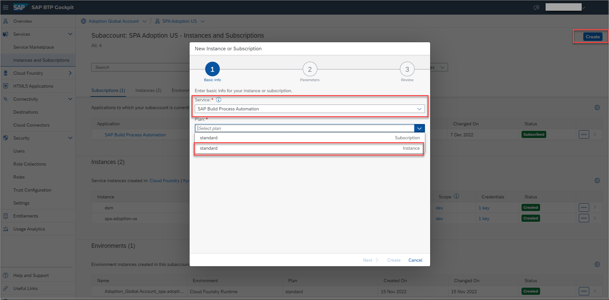
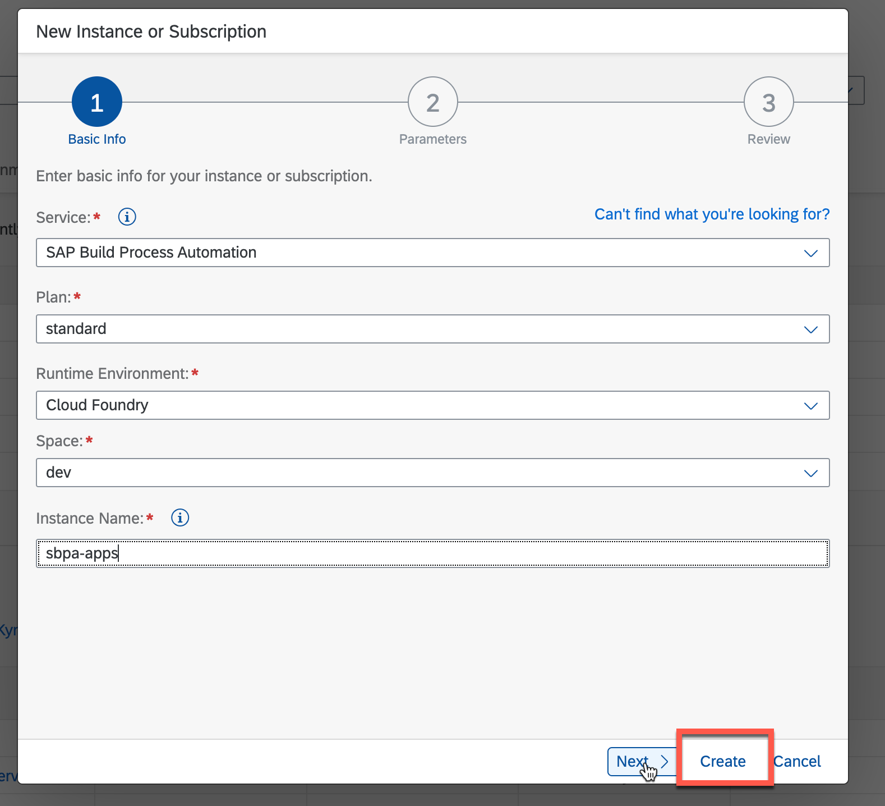
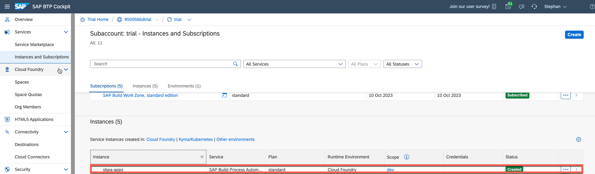
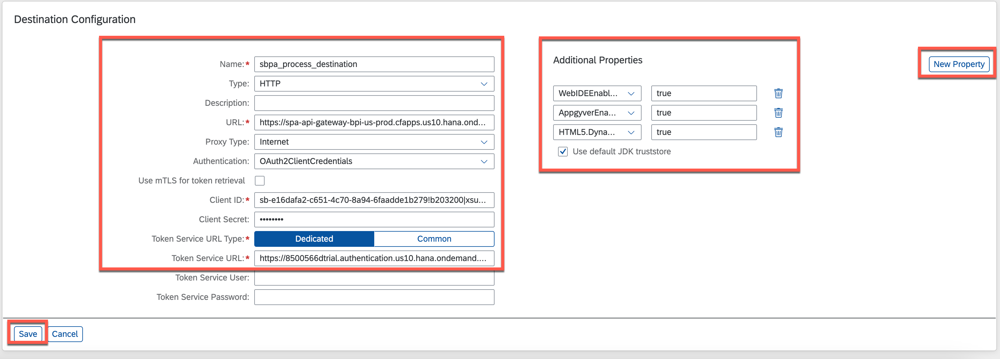

# Create Destination to Trigger Process from any Service
<!-- description --> Create a destination to trigger a business process by creating a service instance and service key of SAP Build Process Automation.

## Prerequisites
- Subscribed to SAP Build Process Automation on trial and assigned the required roles (done via booster)

## You will learn
- How to create a destination in the SAP BTP cockpit to start a business process from SAP Build Apps
- How to create a service instance and service key for SAP Build Process Automation

## Intro
In this exercise, you will create a service instance and service key for SAP Build Process Automation. You would consume the credentials of the service key of SAP Build Process Automation to create a destination that would trigger a business process from SAP Build Apps.

---

### Create an instance for SAP Build Process Automation

Once you have successfully subscribed to SAP Build Process Automation in SAP BTP Cockpit, you can find the Subscription in  your subaccount view, under **Instances and Subscriptions**.

1. Let's create an **Instance** for SAP Build Process Automation. Choose **Create**.

2. Select the Service as **SAP Build Process Automation** and plan as **standard instance**. Choose **Next**.

    

3. Enter the values for other fields as shown below and give an instance name as **sbpa-apps**. Choose **Create**.

    | Field|Value
    | --- | :---
    | Service | SAP Build Process Automation
    | Plan | standard - Instance
    | Runtime Environment | Cloud Foundry
    | Space | dev
    | Instance Name | any name   (sbpa-apps)

      

4. Once the instance is created successfully, you can find it in **Instances** section.

      

### Create a service key for the instance of SAP Build Process Automation  

1. Once you have successfully created the instance, select **...** > **Create Service Key**.

      

2. Enter the name for Service Key as **sbpa-key** and choose **Create**.

      

3. The service key is created and you can view the credentials.

      

4. After the key is provisioned, open it and take note of the following fields:

    - `clientid`
    - `clientsecret`
    - `url`

    These values are needed later in the **Destination Configuration** section.

      

### Create a destination to trigger process

1. Navigate to **Destinations** > **New Destination**. Enter the destination name as `sbpa_process_destination`.

    

2. Enter the details as below.

    | Field|Value
    | --- | :---
    | Name | any name (`sbpa_process_destination`)
    | Type | HTTP
    | Description | any description
    | URL | `https://spa-api-gateway-bpi-us-prod.cfapps.us10.hana.ondemand.com/public/workflow/rest/v1/workflow-instances`
    | Proxy Type | Internet
    | Authentication |  OAuth2ClientCredentials
    | Use `mTLS` for token retrieval |  Off
    | Client ID | Paste the clientid noted previously in step 2
    | Client Secret | Paste the client secret noted previously in step 2
    | Token Service URL Type | Dedicated
    | Token Service URL|  `<url>/oauth/token`, where `url` is noted previously in step 2
&nbsp;

    Copy and paste the URL you have taken in the steps before and add `/oauth/token` to it.
    The final URL should be something like this: 

`https://<your tenant>.authentication.<domain>.hana.ondemand.com/oauth/token`
    | Token Service User| Blank
    | Token Service Password| Blank

    Additionally, enable the following Properties when you would like to integrate with SAP Build Apps.
    Some of the properties you can select from the drop-down list, others you need to enter manually.

    |Property | Value
    | --- | :---
    |`AppgyverEnabled` | true
    |`HTML5.DynamicDestination` | true
    |`WebIDEEnabled` | true

    Select **Save**.

        

    You have successfully created a destination and you can trigger your business process from any service like SAP Build Apps.

### Test the destination

When you will check the connection to the destination, the status will show **401: Unauthorized**. 

> Even though the connection returns unauthorized, the status is successful.

 

### Next Step

Now it's time to [Create SAP Build App to Trigger Process](exercises/2_Build_Apps/2_build-apps-workflow-trigger/build-apps-workflow-trigger.md)
