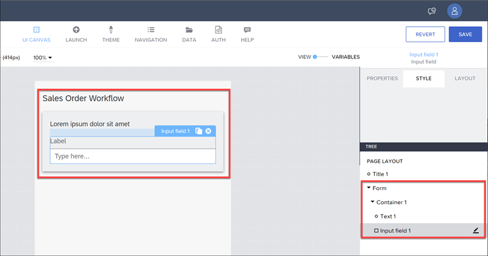
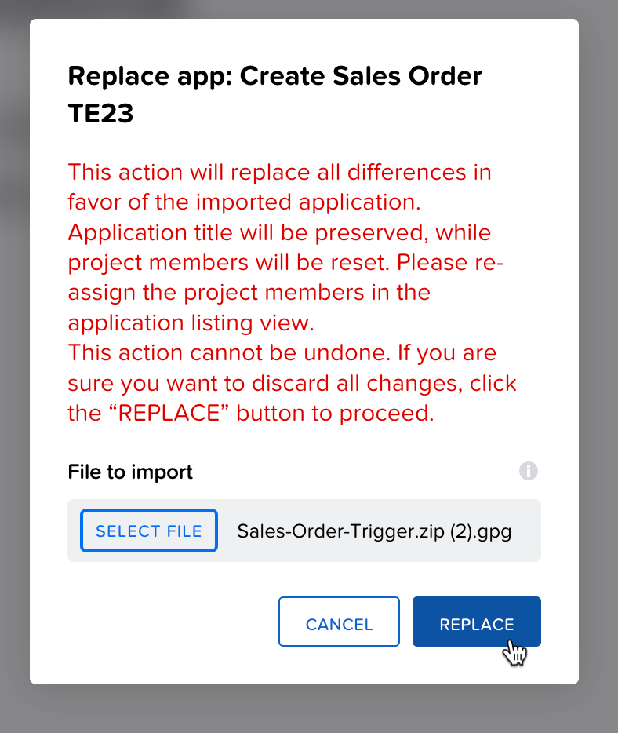
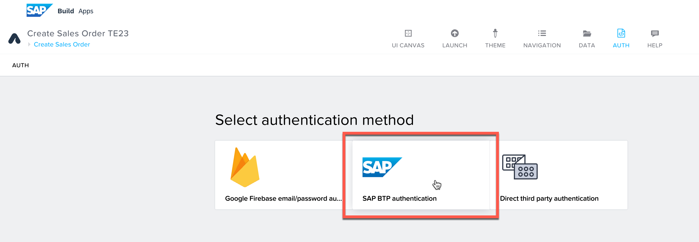
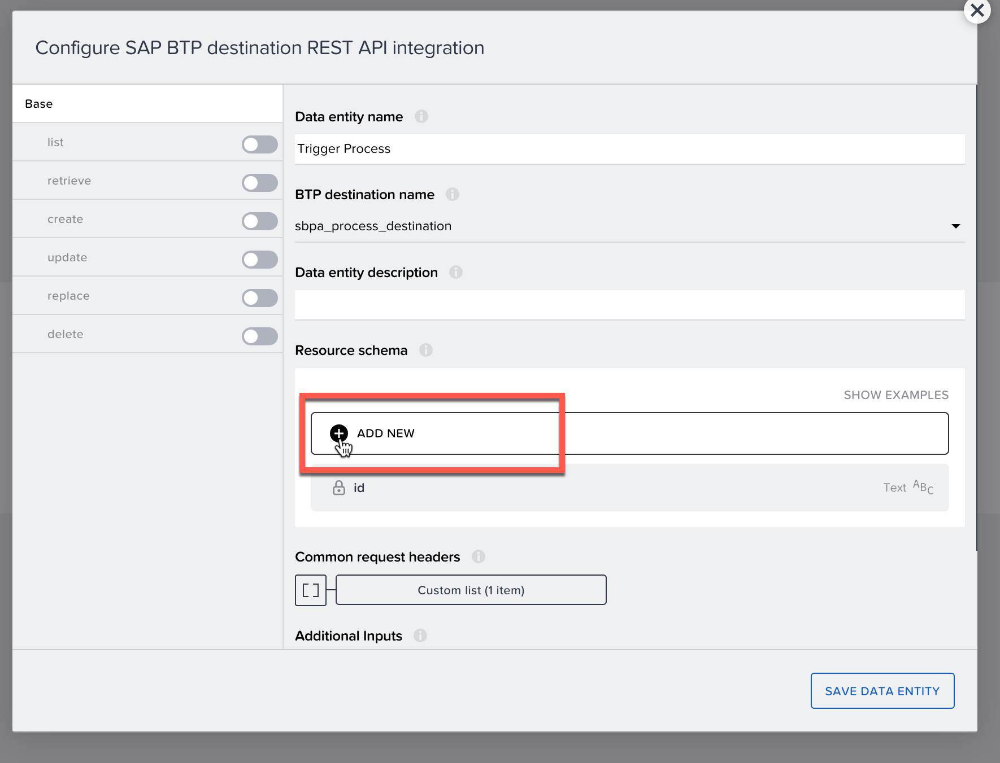
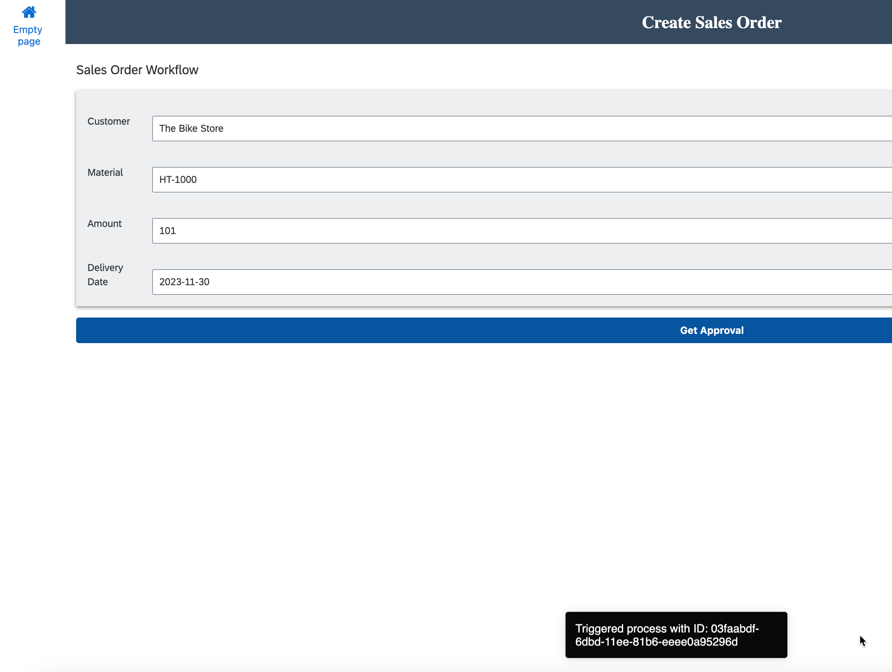

# Create SAP Build App to Trigger Process
<!-- description --> Trigger a process created in SAP Build Process Automation from an app created with SAP build Apps.

## Prerequisites
- You set up SAP Build App and entered the lobby.
- You set up SAP Process Automation, and created the process as described in the exercise section before.
- You know the `definitionId` for the process you created.
- You have set up the destination to SAP Build Process Automation, as described here <link to create instance>

## You will learn
- How to create a simple UI
- How to create a form
- How to stylize your UI
- How to trigger from your app a process in SAP Build Process Automation

## Intro
This tutorial shows you how to use SAP Build Apps to create and stylize a simple, one-page app that triggers a process in SAP Build Process Automation.

Specifically, the app lets the user enter sales order details and then send these to a process for approval. (In a real-world scenario, the sales order would then be created in SAP S/4HANA Cloud, but that is not part of our flow.)

Your app will look something like this:


&nbsp;

>**Before You Begin:** You will need:
The name of the SAP BTP destination to your SAP Build Process Automation instance, which you have created in the exercise before. 
The `definitionId` for your specific process, which you have already copied in one of the former exercises.

---

### A few important UI concepts

Before you go through the exercise, we want to help you understand how apps are developed with SAP Build Apps.

Every app is built on a UI canvas – the canvas is the background of the app. On the canvas, you drag and drop components: text fields, input boxes, toggle bars, images and many other components you want the user to interact with.


Every component has properties, for example: the text to display, the value of the input box and so forth. You select the component and then its properties appear in the **Properties** pane to the right.


Each property is bound to something, for example:
* Static text
* A variable (whose value can be updated elsewhere)
* Data from a backend
* A formula

For the property, you click the binding button ...


... and then select from a menu of bindings.


Finally, for every component there are events, for example, when a user taps a button or enters data in an input box. You can capture these events and then perform an action – like display a dialog, create data in a backend, change the value of variables and much more.

This is done on the logic canvas. Select a component (or no component if you want to capture app events), and then open the logic canvas.


You then drag and drop flow functions and connect them to events. The flow functions are executed whenever that event occurs. And, of course, each flow function has properties to bind 😺.


### Create a new app project
Go to the SAP Build lobby, and click **Create**.


Select **Build an Application**.

   

Select **Web & Mobile Application**.


 
For the project name, enter `Create Sales Order`, then click **Create**.
  


### Create the sales order page
By default your new application contains a page with title and text fields. In this step, you will focus on turning this page into your app – by adding components like input boxes and buttons, and then styling them. 

This is known as creating the user interface, also known as the UI.

>Note that there are 2 options for this exercise step. 
>
>- You can do the first one, **[Basic steps](#option-1---basic-steps)**, which we recommend and which will teach you about UI components, stylizing them, and organizing them on the page.
>
>- You can instead do the second one, **[Import Project](#option-2---import-project)**, which will bypass the nitty gritty of adding and stylizing components, and instead teach you how to import an SAP Build Apps project into an existing project. This way is much faster.
 

### Option 1 - Basic steps

1. Select the text field, and click the **X** to delete it.

    

2. Click on an open area (this brings up the **Properties** tab for the app instead of for a specific component), and in the **Properties** tab, change the **Page name** to `Create Sales Order`.

    

3. Click the title field, and in the **Properties** tab change the **Content** text to `Sales Order Workflow`.

    

4. To the canvas, drag a Container component. 

    >Container components let you group components and configure the collection of the components as a single unit.

    With the container selected, in the **Properties** tab, change the **Component display name** to `Form`.

    

    Still with the container selected, open the **Style** tab, click the dropdown icon for the Layout Container, and click **Edit**. 

    

    - For the background color, select **Level 4 background**.

    - For padding, set the padding on all 4 sides to 16px by clicking each rectangle, going to **Theme**, and selecting the **L** size.

        

    - For **Effects**, create a shadow by setting these properties:

        | Field | Value |
        |-------|----------|
        | **Enable Shadow**    | True   |
        | **Shadow size**    | Content Shadow 0   |
        | **Shadow color**    | `#8e8989`<div>&nbsp;</div>Click the **X**, and then select **Static color**. You can then copy and paste in the color code, or use the color picker to choose a color. |

    - Let's save the style by scrolling up in the **Style** tab, clicking **New Style**, entering `Layout Form Container`, and clicking **OK**. 

        

    This saves the new style in the **Style** tab.

5. Into this container ( **Form** ), drag in another container.
   
    >It may be easier to drag it into the **Tree** view on the lower right, so you can put it precisely where you want. The **Tree** makes it easier to select specific components and to create a hierarchy of components on the page.

    Inside the new container add a text and input field. The result should look like this:

    

    Select the new, inner container ( **Container1** from the **Tree** view), go to **Layout** tab, and under **Layout** set the container to **Horizontal**. Then, set **Align components** to middle.

    
    
    Select the text field, go to the **Layout** tab, then **Width and Height**, and set the width to exactly 75px.

    
    
    Select the input field, and in the **Properties** tab, delete `Label` from the **Label** property.  

6. From the **Tree** view, select the inside container ( **Container1** ).

    
 
    Duplicate the container by clicking on the **Duplicate** icon.
   
    
 
    Repeat this 2 more times, until you have 4 fields.

    

7.  Click on each field label and change it to the following field names, in this order:

    | Fields | 
    |-------|
    | Customer    | 
    | Material    | 
    | Amount    | 
    | Delivery Date    | 

    

8.  At the bottom of the page (outside the outside container), add a button.

    In the **Properties** tab, set the **Label** to `Get Approval`.

    

    In the **Style** tab, next to **Primary Button**, click the dropdown button and select **Edit**.

    For **Background color**, change the color `Brand` to `Highlight`.

9.  Click **Save** (upper right).

Skip **Option 2** and move on with **[Enable SAP BTP authentication](#Enable-SAP-BTP-authentication)**


### Option 2 - Import Project

We really want you to see some of things related to stylizing you can do with SAP Build Apps. But we understand that stylizing a UI may be tedious for some people.

If you really want, you can skip doing the stylizing and instead import the project already stylized. If you want to take this route, do the following:

1. Download the file [`Sales-Order-Trigger.zip.gpg`](https://github.com/sap-tutorials/sap-build-apps/raw/main/tutorials/build-apps-workflow-trigger/Sales-Order-Trigger.zip.gpg).

2. Click the 3 dots next to **History** in the upper-right corner.

     

3. Select **Replace**.

4. Select the file you downloaded.

5. Click **Replace**

    


Whether you have chosen option 1 or option 2 now move on with the following steps.

### Enable SAP BTP authentication
You need to enable SAP BTP authentication because you want to use SAP BTP destinations, and users need to be authenticated to use them.

SAP BTP destinations are connections to backend services – each specifies the location of a backend and how the user will be authenticated. The destinations can be used by the various services within SAP BTP, including SAP Build Apps.  

SAP BTP authentication also has the benefit of requiring authentication in your app and reusing the built-in SAP BTP authentication mechanism.

1. Go to the **Auth** tab.

2. Click **Enable Authentication**.

    

3. Select **SAP BTP Authentication**.

    On the confirmation popup, click **OK**. 

    


### Create data resource to SAP Build Process Automation
As part of setting up SAP Build Process Automation, you created an SAP BTP destination that points to SAP Build Process Automation APIs, so that you can trigger workflows.

Now you will set up the connection from your app to that destination, so you can call SAP Build Process Automation.

### Create Data Resource

1. Open the **Data** tab, at the top of the page.

2. Scroll down, and and under **SAP Build Apps classic data entities**, click **Create Data Entity > SAP BTP Destination REST API Integration**.

    

    The configuration screen appears, starting with the **Base** panel.
 
3. On the **Base** panel, enter the following:

    | Field                | Value                                         |
    | -------------------- | --------------------------------------------- |
    | Data entity name   | `Trigger Process`                             |
    | BTP destination name | `sbpa-process-destination` (or the destination you created, if you created your own) |

    

4. Under **Resource schema**, click **Add New**.

    
   
    Add a field of type **Object** and with the name `salesorderdetails`, and click **Add**.

    

    Click on the new field, and add the following sub-fields to the object:

    

    **IMPORTANT:** Click on the **Add New** button **BELOW** the `salesorderdetails` field.

    | Field Name           | Type   |
    | -------------------- | ------ |
    | **`ShipToParty`**          | ***Text***   |
    | **`Material`**             | ***Text***   |
    | **`OrderAmount`**          | ***Number*** |
    | **`ExpectedDeliveryDate`** | ***Text***   |
    | **`Division`**             | ***Text***   |
    | **`SalesOrderType`**       | ***Text***   |
    | **`ShippingCountry`**      | ***Text***   |
    | **`SalesOrganisation`**    | ***Text***   |
    | **`DistributionChannel`**  | ***Text***   |

    >**IMPORTANT:** Enter the fields exactly as shown above. Otherwise SAP Build Process Automation will not match what you send with the fields you defined there. Also, there is no date type in this window, so dates should be entered as text fields.

    It should look like this:

    

5. Click the **create** panel.

    Then enable the create action with the toggle button.

    
    &nbsp;<br>

    

6. For **Request headers**, click the binding **X**, then **List of values**.

    

    

    Click **Add a value**, and add the following key-value pair:

    | Field            | Value              |
    | ---------------- | ------------------ |
    | **Header name**  | `Content-Type`     |
    | **Header value** | `application/json` |

    

    Click **Save**.

7. For **Request body mapper**, click the binding **X**, then **Formula > Create formula**.

    Enter the following for the formula -- replace `<your definition ID>` with the ID for your process that you saved from your process trigger:

    ```JavaScript
    ENCODE_JSON({  "definitionId": "<your definition ID>",  "context":  query.record })
    ```

    >If you forgot the `definitionID` for your process, you can simply open the deployed version of your SAP Build Process Automation project, and view the trigger you created. This was all explained in the previous tutorial [Run the Sales Order Business Process](xxx).

    The formula should look something like this:

    

    Click **Save** twice.

    >The request body mapper will format the body of this HTTP request. For SAP Build Process Automation trigger API, the body provides the name of the process you want to trigger, plus all the input fields defined for that process.

8. Click **Save Data Entity** (bottom right).

    Click **Save** (in the upper right to save all your changes to the project).


### Test the trigger
SAP Build App enables you to test whether your connection works. Here, we will trigger the workflow manually.

1. Open the data resource again by clicking it.
   
    

2. Click **create** on the left, and then the **Test** tab.

3. Enter values for the fields (really, you only need to enter an order amount), and then scroll down and click **Run Test**.

    >**IMPORTANT:** Date fields must be in the format of `2022-12-25` and the order amount must be a number.

    

    


If all works OK, you will get a **201** status code and a response with information about the process instance you just triggered, something like this:

```JavaScript
{
  "id": "98161c6e-6db8-11ee-89f5-eeee0a87ee4b",
  "definitionId": "us10.8500566dtrial.salesordermanagementte23.orderProcessing",
  "definitionVersion": "2",
  "subject": null,
  "status": "RUNNING",
  "businessKey": null,
  "parentInstanceId": null,
  "rootInstanceId": "98161c6e-6db8-11ee-89f5-eeee0a87ee4b",
  "applicationScope": "own",
  "projectId": "us10.8500566dtrial.salesordermanagementte23",
  "projectVersion": "1.0.1",
  "startedAt": "2023-10-18T13:16:48.806Z",
  "startedBy": "sb-clone-390ed564-e379-4dad-9619-bbb81a4d2bfb!b49390|workflow!b1774",
  "completedAt": null
}
```


> **COMMON ISSUES**
>
>**403:** The destination to the SAP Build Process Automation API is not configured properly. Make sure the client ID, secret, service URL and authentication URL (with `/oath/token` path) are set correctly. Do not add user/password for the authentication URL.
>
>**404:** The API did not recognize the name of your process (i.e., `definitionId` in the request body mapper) or the path to the service is wrong -- both in the **create** tab.
>
>**415:** You did not send the `Content-Type` request header.
>
>**422:** This basically means that the API heard your call but it didn't like something in the request body.
>
>- The format of a field may be wrong, for example, text for a number field or an invalid date format (dates must be in this format: `2023-01-31`). 
>
>**500:** This may mean that your URLs are wrong, especially, you may have the wrong URL for OAuth authentication, such as you forget to add the path `/oauth/token`.
>
>Note that field names are case sensitive. This will not cause an error in the API call, but the values will not be passed to the workflow properly and you will not see the values in the workflow forms.

If you've gotten to here, your integration with SAP Build Process Automation is working!!

You can go into the SAP Build Process Automation monitoring and see there the process you just triggered, and check the context to make sure the parameters were sent properly.


You can also check the Inbox to see the forms were created and the values properly passed into the workflow.


In any event, you can close your data resource definition by clicking **Save Data Entity**.


### Create data variable
Whenever we want to trigger a workflow, we need to send some data – in this case, the sales order information.

So we will create a variable that will hold the information. A data variable is based on a specific data resource -- in this case the one to trigger our workflow -- and the variable's schema is automatically duplicated from the data resource.

1. Back on the UI canvas (click the **UI Canvas** tab at the top), select **Variables**.

2. On the left, click **Data Variables**.
   
3. Click **Add Data Variable**, and choose **Trigger Workflow** as the data resource on which to base the data variable.

    >The schema of the data variable will be the same as the data resource.

    

    

4. On the right, choose **New data record**.

    

5. Click **Save** (upper right).

>Make sure the name of the data variable is exactly `Trigger Process1` with no extra spaces or characters.


### Bind data variable to UI elements
We created a variable for the sales order data, but now we need to get the data entered by the user into the variable. We do this by binding the variable to UI elements, specifically, to the input boxes.

Whenever someone types into the input box, the value is automatically copied into the variable.


1. Go back to **View** so you can see the UI canvas.
   
2. Click on the first input field (for **Customer**).

    In the **Properties** tab, click the **X** next to the **Value** field, and select **Data and Variables > Data Variables > Trigger Process1 > shipToParty**.

    

    Click **Save**

3. Click on the second input field (for **Material**).

    In the **Properties** tab, click the **X** next to the **Value** field, and select **Data and Variables > Data Variables > Trigger Process1 > material**.

    Click **Save**

4. Click on the third input field (for **Amount**).

    In the **Properties** tab, click the **X** next to the **Value** field, and select **Data and Variables > Data Variables > Trigger Process1 > orderAmount**.

    Click **Save**

5. Click on the fourth input field (for **Delivery Date**).

    In the **Properties** tab, click the **X** next to the **Value** field, and select **Data and Variables > Data Variables > Trigger Process1 > expectedDeliveryDate**.

    Click **Save**

6. Click **Save** (upper right).


### Add logic to trigger the process
We need to set up the logic so when someone clicks the **Get Approval** button (an event), we send the sales order data to our process in SAP Build Process Automation using the data resource we have previously created. 

1. Click on the **Get Approval** button, and open the logic canvas by clicking **Show logic for Button1** at the bottom right to open the logic editor.

    

2. Drag a **Create record** flow function onto the canvas, and connect the component tap event to it.
   
    

3. Click on the **Create record** flow function and configure it in the **Properties** pane on the right.

    

    For **Resource name**, this should already be set to **Trigger Process**, since you have only one data resource.
    
    For **Record**, you have to bind each of the data variable fields to the appropriate record field. 

    There are many ways to do binding. For **Record**, you will use a formula simply because it is faster, though formulas are one of the most important binding types and provide a lot of flexibility.
    
    Click on the object binding button:
    
     
    
    Click **Formula**, then click on the existing formula, and replace it with the following:
   
    ```JavaScript
    {salesorderdetails: {shipToParty: data["Trigger Process1"].salesorderdetails.shipToParty, material: data["Trigger Process1"].salesorderdetails.material, orderAmount: NUMBER(data["Trigger Process1"].salesorderdetails.orderAmount), expectedDeliveryDate: data["Trigger Process1"].salesorderdetails.expectedDeliveryDate, division: "1010", salesOrderType: "OR", shippingCountry: "Barbados", salesOrganisation: "10", distributionChannel: "1000"}}
    ```

    >**IMPORTANT:** The formula assumes that you named your data variable `Trigger Process1`, which should be the default name if you named your data resource `Trigger Process`.

    >A typo in the name of the data variable, like an extra space, will mess up the binding.

    Click **Save**.
    
    >**What does the formula do?**
    >
    >The 4 main fields we want to send should already be in our data variable, since we bound it to the input boxes. But we need to:
    >
    >
    >- Format the number value for the order amount (if not it will sent as string and this will cause an error).
    >- Send values for some other fields (for future use).
    >
    >You can do all this field by field -- using the **Object with properties** binding -- but to save time we gave you the formula.
    >
    >If you want to explore, open the binding for the **Record** field and select **Object with properties** and you can see the UI where you can set each field by hand.
    
  


4. Drag a **Toast** flow function onto the canvas, and connect the **top** output of the **Create record** flow function to it.

    

5. Click on the **Toast** flow function and configure it in the **Properties** pane on the right.

    For **Toast message**, click on the **ABC**, and then select **Formula > Formula**.

    

    Erase the quotation marks, and enter the following formula:

    ```JavaScript
    "Triggered process with ID: " + outputs["Create record"].response.id
    ```

    Click **Save**.

6. Click **Save** (upper right).


### Run app
1. Click the **Launch** tab, and then **Open Preview Portal**.

    

3. Click **Open web preview** (left).

4. Select your project, **Select Order Trigger**.

    

5. Enter the following values in your form:

    | Field | Value |
    |-------|-------|
    | Customer | `The Bike Store` |
    | Material | `HT-1000` |
    | Amount  | `101` |
    | Delivery Date  | `2023-11-30` |

6. Click **Get Approval**. When the toast message appears take a screenshot.

Your process should be triggered and require approval (since the amount above 100).

You should see the toast message indicating the workflow was triggered, and with the process instance ID.



You can also see the results of the call in SAP Build Process Automation.

Go to the **Monitor** tab, then **Monitor > Process and Workflow Instances**. The first one should be the one you just triggered.

- You can see the new process instance.
- You can see the process ID is the same as in the toast message in the app.
- You can see the context, which is the values sent with the API (4 of them, in yellow, you entered in the input fields and the others were hardcoded in the formula for the **Create record** flow function).
- You can also see the execution log, which shows that the process stopped at the approval step (since it was above 100) and is awaiting approval. If you expand the approval step you can see more information, including who the approval request was sent to.


### Next Step
Move on with the next step to [deploy the app created with SAP Build Apps to SAP BTP](/exercises/2_Build_Apps/3_build-apps-deploy/build-apps-deply.md).