# Deploy app from SAP Build App to SAP BTP
<!-- description --> Deploy an app created with SAP Build Apps to HTML5 applications on SAP BTP.

 
## Prerequisites
- To deploy, you need to be a member of the Cloud Foundry org and space to which you will be deploying to.

## You will learn
- How to deploy an app created with SAP Build Apps to SAP BTP

## Intro
After creating an app in SAP Build Apps, and after viewing the preview on the web, you can deploy it directly to SAP BTP, like any other HTML5 application.

As of the writing of this exercise, you could only deploy to an Cloud Foundry org's default space.

>**IMPORTANT:** You need to be a member of the Cloud Foundry org and space to which you will be deploying to. Which you normally are.

>As you are an admin of the SAP BTP trial subaccount, you can see who is an org member by going to the cockpit and navigating to **Cloud Foundry > Org Members**.

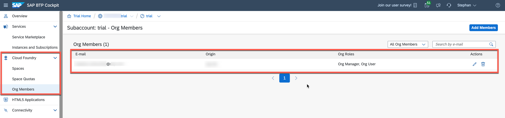

---

### Build the app
1. Open the **Launch** tab.
   
2. Select **Open Build Service**.
   
    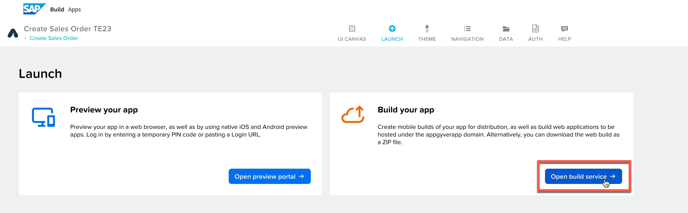

3. Underneath Web App click **Build**.

    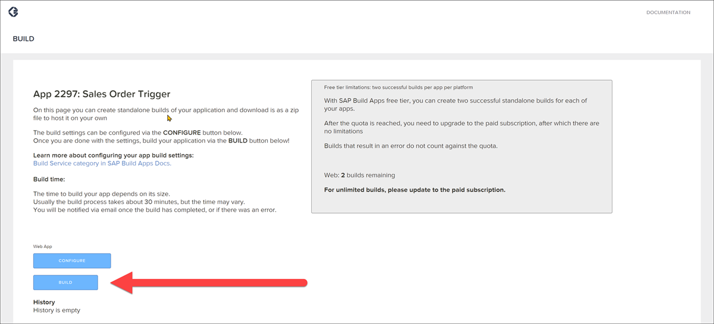

4. Select **MTAR**.
   
    Select the most current runtime version.

    Enter a version for your app, for example `1.0.0`.

    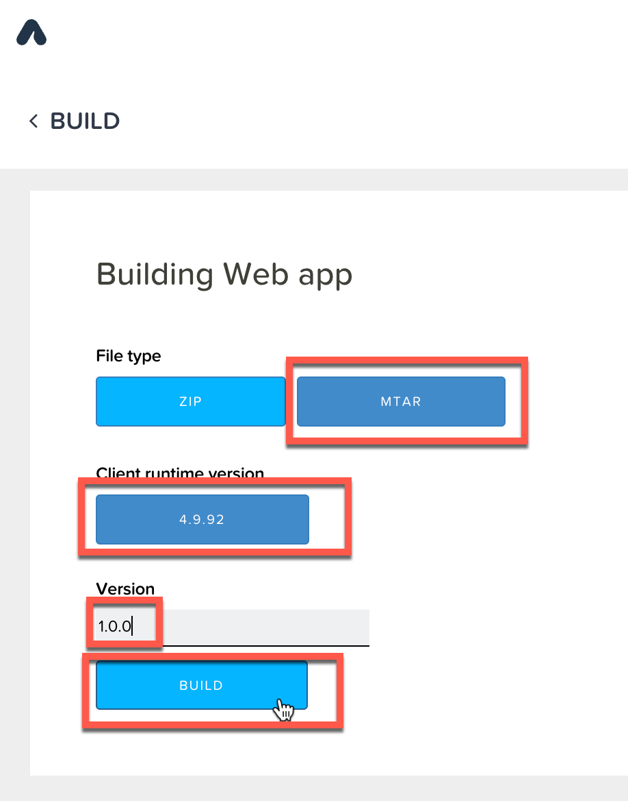

5. Click **Build**.

The build may take a a little while (20 minutes or so). Take a breath and have a break.
If you refresh the page, the status will change from `created` to `queued` to finally `delivered`.

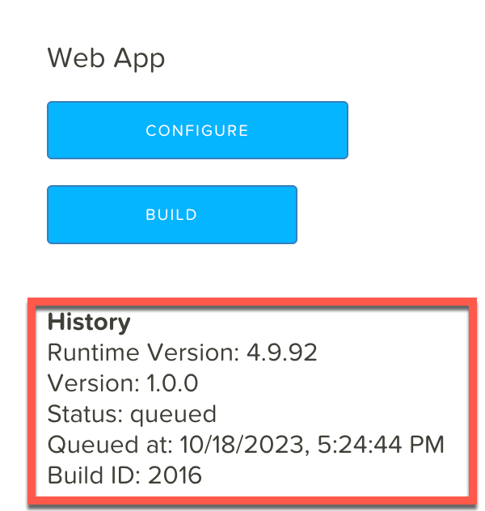

### Deploy app
Before deploying, you must have a build showing as `delivered`.

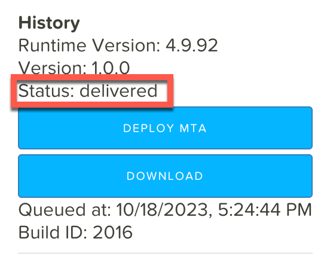

1. Click **Deploy MTA**.

    The first you deploy, you will get the following to sign in to Cloud Foundry so you can deploy the app.

    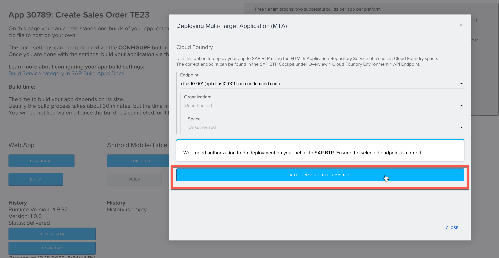

    >If you have rights to Cloud Foundry on more than 1 BTP tenant, you will need to choose the environment. Otherwise, the environment will automatically be chosen. 

2. Click **Authorize BTP Deployments**.

    You will get a dialog for signing in to the deployment environment (Cloud Foundry).
    
    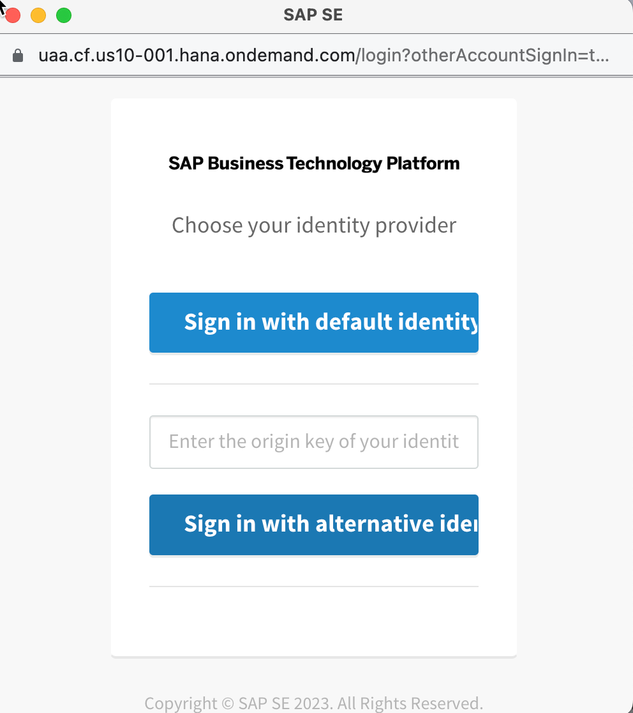

3. Then click **Sign in with default identity provider**.
    
4. Click **DEPLOY MTA TO DEV**.

    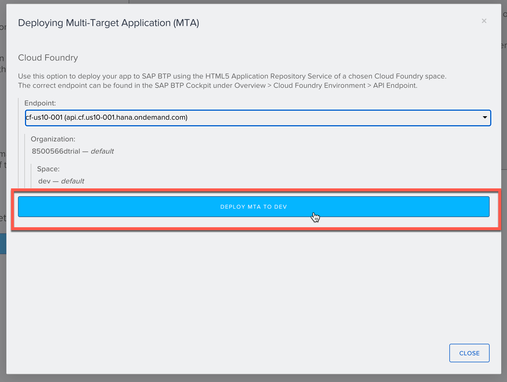

    The screen will show a running list of log messages ... this could take about 2 minutes.

    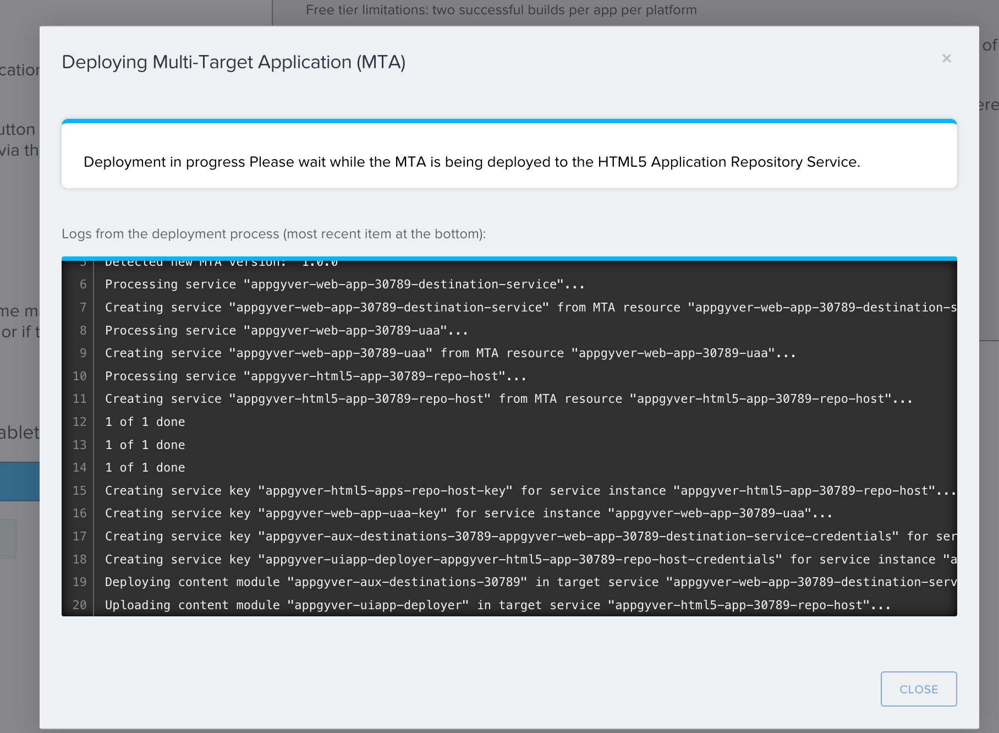

    Once it is done, you will get a screen like this:

    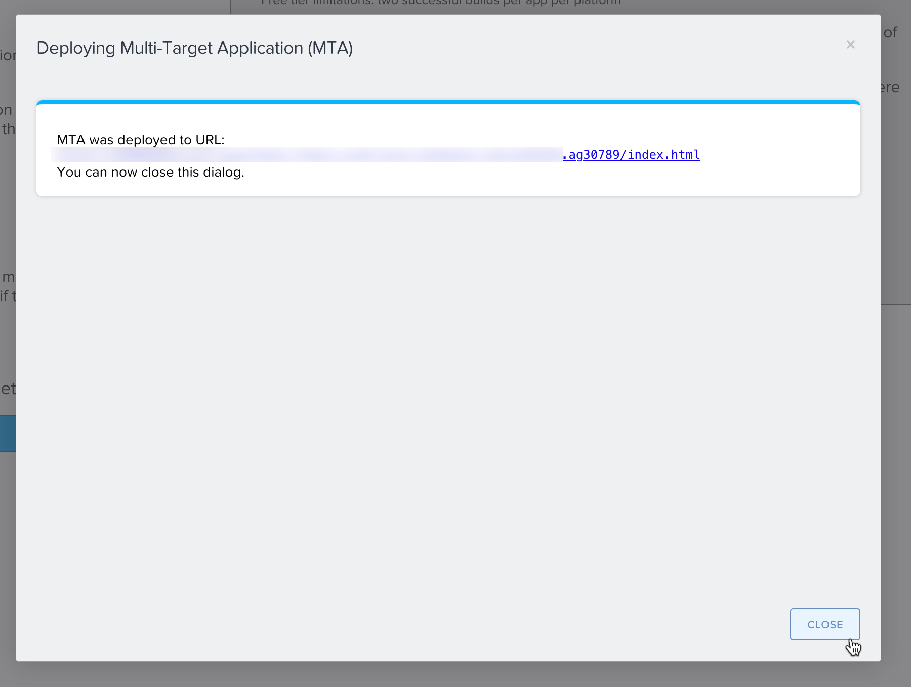

    The name of the app is at the end of the URL, for example, above in the picture, `ag30789`.

    **Copy** and **save** the URL.

### Run app
1. Open your subaccount's cockpit.

2. Go to **HTML5 Applications**, and find your app.

    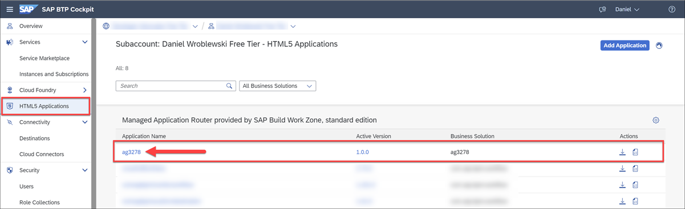

    Click the application link (save this link if you later want to embed the app in SAP Build Work Zone).

    You should now see your application. 

### Next Step
Congratulations, your are now also done with the exercises around SAP Build Apps.
Now move on with the exercises around SAP Build Work Zone and start with [Create a Site Using SAP Build Work Zone, standard edition](/exercises/3_Build_Work_Zone/1_cp-portal-cloud-foundry-create-sitelaunchpad/cp-portal-cloud-foundry-create-sitelaunchpad.md).
