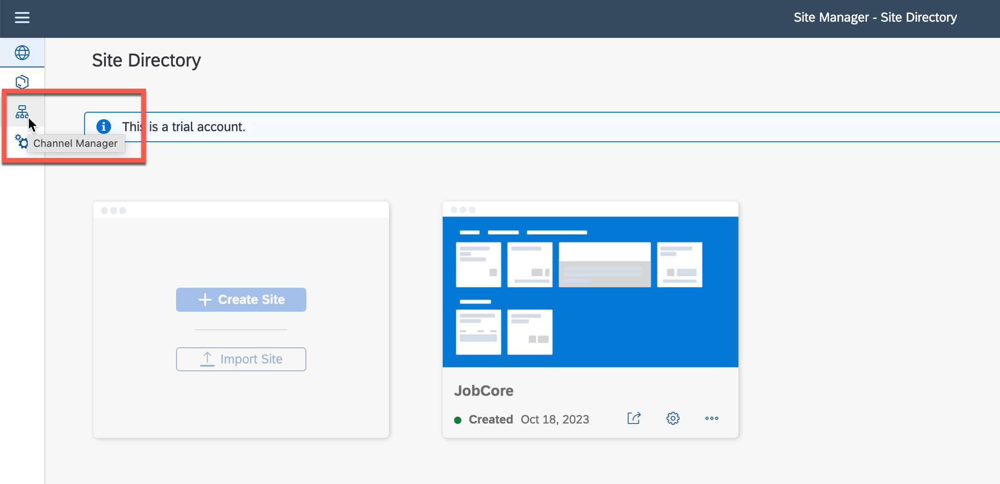
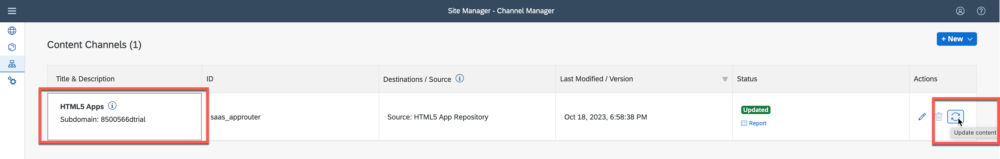
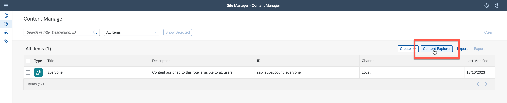
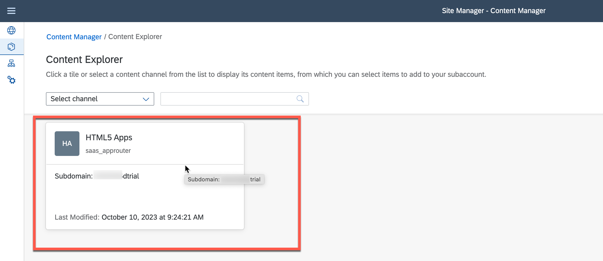
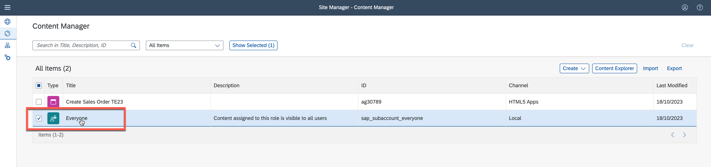
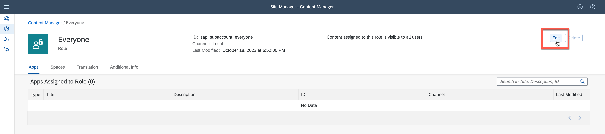
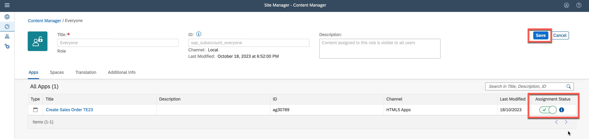
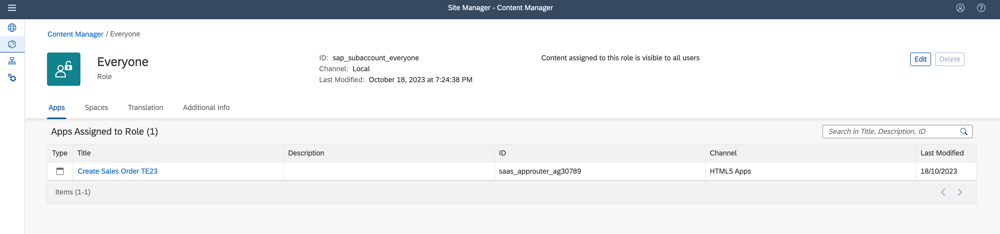

# Integrate an SAP Build Apps application into SAP Build Work Zone, standard edition
<!-- description --> Add an SAP Build Apps application to a workpage in your workspace.

## Intro
In this exercise you will integrate to your site the app you developed using SAP Build Apps.

The site you will design will have a space and a page.

## Integrate your app to SAP Build Work Zone

### Fetch updated content using the Channel Manager

1. Click the Channel Manager icon to view any available content providers.

2. Select the **HTML5 Apps** content provider and click **Refresh**.

The HTML5 Apps content provider should now expose any newly deployed app for integration.

### Add your deployed app to your content
1. Click the icon in the side panel to open the Content Manager.

The Content Manager shows your current Content. Navigate the Content Explorer where you can explore exposed content from available content providers, select the content, and add it to your own content.

2.  Click the Content Explorer to explore content from the available content providers.

3.  Select the HTML5 Apps provider.

4.  You’ll see that your app that you’ve just deployed in SAP Build Apps, already exists in this provider. Select it and click + Add to My Content.

5. Click the Content Manager to navigate back from the Content Explorer

Note that your app is in the list of content items.

### Assign your app to the Everyone role

1. In the Content Manager select and open **Everyone**.

2. Click **Edit**.

3. Change the **Assignment Status** and click **Save**.

4. Your app is assigned now to the Everyone role.

## Next Step
Move on with the next step [Add My Inbox from SAP Build Process Automation to SAP Build Work Zone](/exercises/3_Build_Work_Zone/3_spa-configure-workzone/AddMyInboxWZ.md)