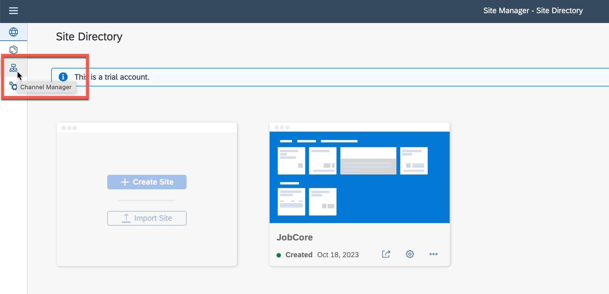
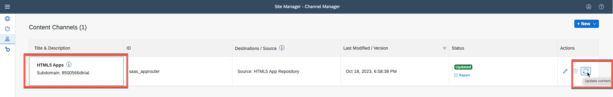
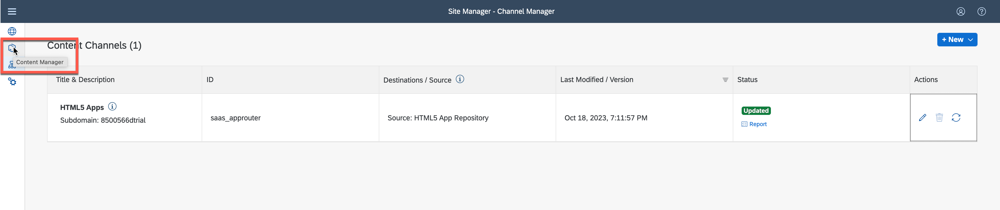
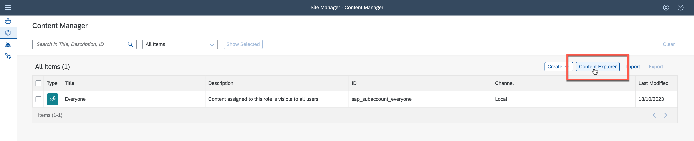
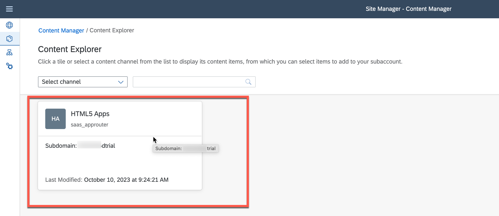
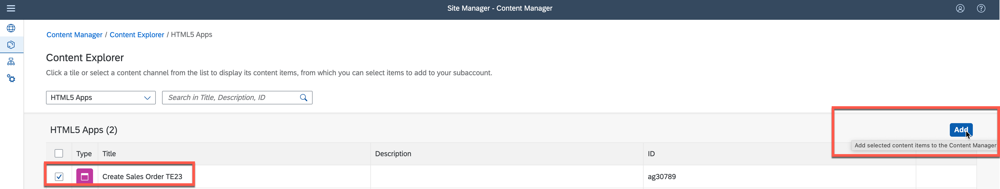
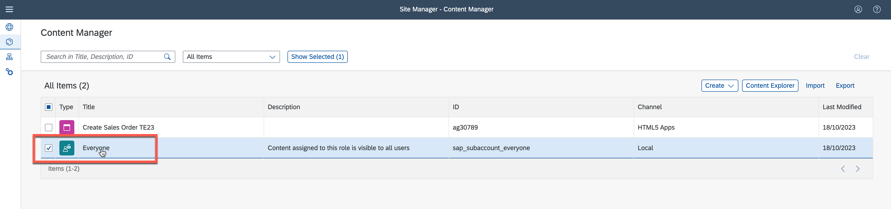
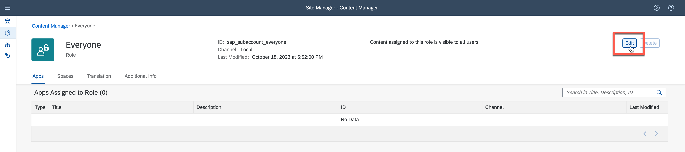
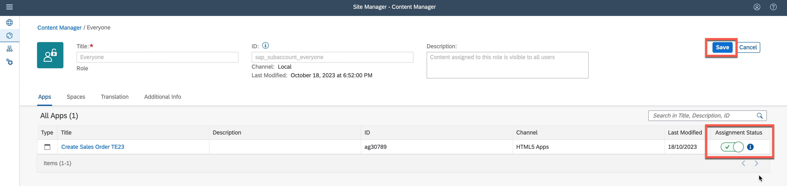
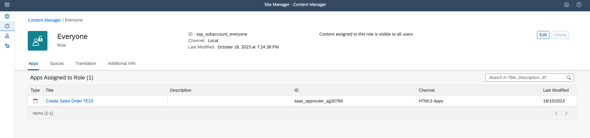

# Integrate an SAP Build Apps application into SAP Build Work Zone, standard edition
<!-- description --> Add an SAP Build Apps application to a workpage in your workspace.

## Intro
In this exercise you will integrate to your site the app you developed using SAP Build Apps.

The site you will design will have a space and a page.

## Integrate your app to SAP Build Work Zone

### Fetch updated content using the Channel Manager

1. Click the Channel Manager icon to view any available content providers.

2. Select the **HTML5 Apps** content provider and click **Refresh**.

The HTML5 Apps content provider should now expose any newly deployed app for integration.

### Add your deployed app to your content
1. Click the icon in the side panel to open the Content Manager.

The Content Manager shows your current Content. Navigate the Content Explorer where you can explore exposed content from available content providers, select the content, and add it to your own content.

2.  Click the Content Explorer to explore content from the available content providers.

3.  Select the HTML5 Apps provider.

4.  You’ll see that your app that you’ve just deployed in SAP Build Apps, already exists in this provider. Select it and click + Add to My Content.

5. Click the Content Manager to navigate back from the Content Explorer

Note that your app is in the list of content items.

### Assign your app to the Everyone role

1. In the Content Manager select and open **Everyone**.

2. Click **Edit**.

3. Change the **Assignment Status** and click **Save**.

4. Your app is assigned now to the Everyone role.

--------
## Design your site

### Create and design a page.

1. Open the Content Manager.

2. Click **Create** and from the dropdown list, select **Page**.

3. Enter a title for the page: **Overview_id**, Where id is your unique id, and click on **Add Section** 

4. Keep the section a title empty and click Add Widget.
 

5. In the Add Widgets screen, click **Cards**.
 

6. Select the **AD272header** card to add it to this section
 

7. Click the **+** sign to add another ection

 

8. Give the section a title **Risks** and click **Add Widget**.

 

9. In the Add Widgets screen, click **Tiles**.

10. Select your app tile and click **Add**.

11. Click **Add Widget** in the same section

12. Select **cards**
 

13. Select risks card and click **Add**.

14. Hover over the Apps widget and click the + icon to add another app

15. Select the MyInbox app 

16. Click **Save**

17. Click the **Content Manager** to navigate back to the Content Manager

### Create a space.
1. In the **Content Manager** click Create and then select **Space**.

2. Enter a title for the space: **Home_id**, where id is your unique id, enable your page in this space, and click **Save**.

3. Go back to the Content Manager using the breadcrumbs at the top. You’ll see that the space you created is added to the list of content items.

### Assign your app and space to a role
In this step, you’ll assign your space and app to the Everyone role.

Spaces and apps are assigned to a role. Users assigned to a specific role are able to access the space and see the relevant pages assigned to it. Content assigned to the Everyone role is visible to all users.

1. From the Content Manager, click the Everyone role.

2. Click **Edit**.

3. Under the Apps tab, you’ll see the your app that you deployed. Click the toggle to assign the this app to the role. Then click Spaces tab

4. Under the Spaces tab, you’ll see the **Home_id** space you just created. Click the toggle to assign the **Home** space to the role. Then click **Save**.

