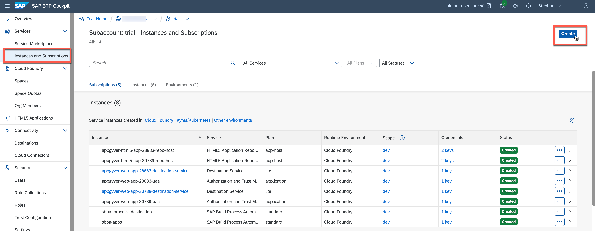
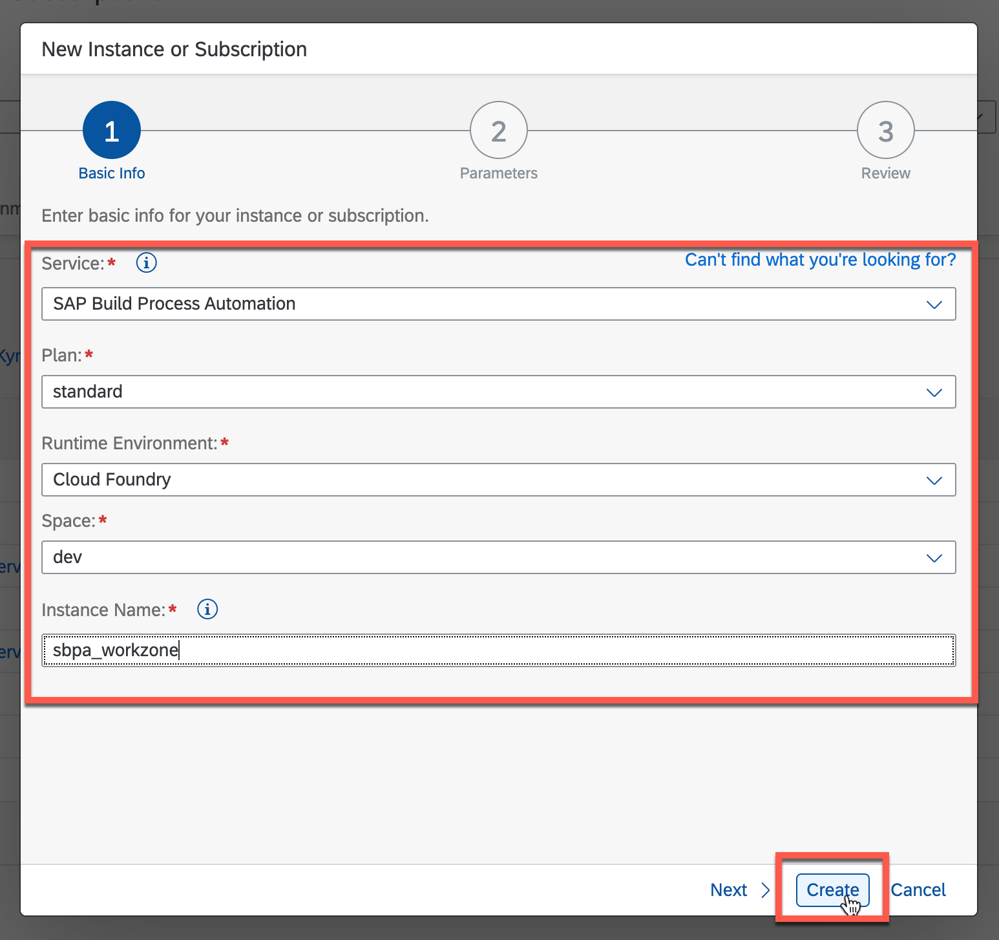
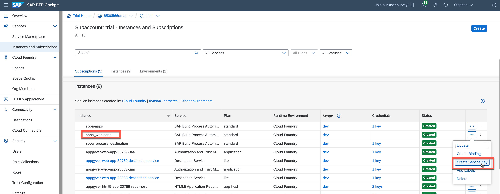
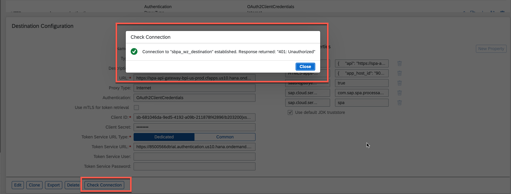
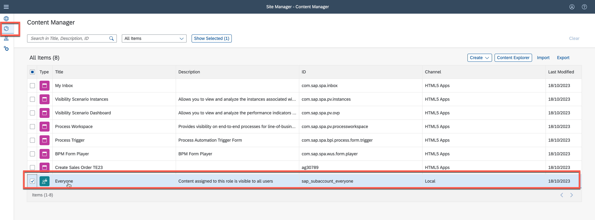
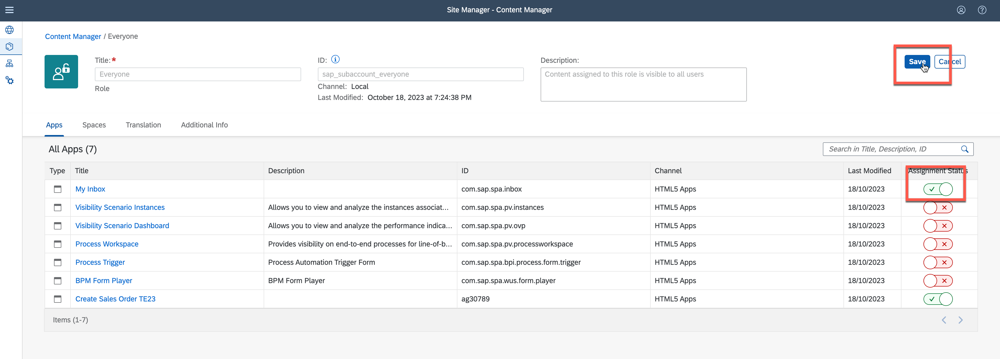

# Add My Inbox from SAP Build Process Automation to SAP Build Work Zone

## You will learn
  - How to add an existing app to your site

## Intro
In this exercise, you'll use the **Content Manager** to add apps to SAP Build Work Zone.

### Create a new instance 

1.  Navigate to **SAP BTP Cockpit** subaccount. Select **Services** > **Instances and Subscriptions**. Choose **Create**.

    

2.  For the new instance:
    -  Select **SAP Build Process Automation** as a **Service**.
    -  Select **standard** plan from the **Plan** list.
    -  Select **Cloud Foundry** as **Runtime Environment**.
    -  Select a space from **Space** list.
    -  Set **Instance Name** as **sbpa_workzone**.
    -  Choose **Create**. 

  

3. The instance has been added.

  

### Create a Service Key for the SAP Build Process Automation Instance

You can use service keys to generate credentials to communicate directly with a service instance. Once you configure them for your service, local clients, apps in other spaces, or entities outside your deployment can access your service with these keys.

1. In your SAP BTP subaccount, under **Services**> **Instances and Subscriptions**, select the instance that you created above, select the three dots and select **Create Service Key**.
   
  

2. On the creation screen, enter any name for your service key and choose **Create**.

  

The service key is created and you can view the credentials. 

  

1. Once you open it, download the json file.

    > You will need these credentials to configure destinations.

  

### Configure SAP Build Process Automation Destination

To be able to configure SAP Build Work, standard edition for use with SAP Build Process Automation, you must create an SAP BTP destination for your subaccount.

> You have created a service instance and service key for SAP Build Process Automation and noted down the service key credentials for configuring this destination.

1. Choose **Connectivity**> **Destinations**> **New Destination**.

  

2. Choose **Blank Template**, and enter the following details from the downloaded json file:

    > CAUTION: When copying the values for URL, Client ID, Client Secret and Token Service URL, please select the values without the quotes and paste them in the destination template. 

    |  **Field**    | **Value**
    |  :------------- | :-------------
    | Name      |  `sbpa_wz_destination`
    | Type       | HTTP
    | Proxy Type       | Internet
    | Authentication      | `OAuth2ClientCredentials`
    | URL      |    `<"endpoints"."api">`
    | Client ID       | `<"uaa"."clientid">`
    | Client Secret | `<"uaa"."clientsecret">`
    | Token Service URL | `<"uaa"."url">` add /`oauth`/token
    
    For your values, please refer to screenshot below:

  

3. Add additional properties copied from the service key:

    > CAUTION: When copying the values for`saasregistryenabled`, `sap.cloud.service` and `sap.cloud.service.alias`, please select the values without the quotes.

    |  **Field**    | **Value**
    |  :------------- | :-------------
    |  `endpoints`        | `endpoints` copy the whole JSON structure including `{` and `}`
    |  `html5-apps-repo`       | `html5-apps-repo` copy the whole JSON structure including `{` and `}`
    |  `saasregistryenabled`        | `saasregistryenabled`
    |  `sap.cloud.service`        | `sap.cloud.service`
    |  `sap.cloud.service.alias`        | `sap.cloud.service.alias`

    For your values, please refer to the screenshot below:

  

4. **Save** your changes.

  

5. Test the destination by selecting **Check Connection**.

  

You should receive this response message "401: Unauthorized"

### Open and manage SAP Build Work Zone Application

1.  Navigate back to **SAP BTP Cockpit** subaccount. Choose **Services** then **Instances and Subscriptions**. Choose **Go to Application** next to **SAP Build Work Zone, standard edition**.

   

2. The Site Manager is now ready to use. Select **Channel Manager**.

  

3.  Choose **Update Content**.

  
    
    > The content updates and the status changes to Updated.

4.  Select **Content Manager**. On the top tabs select **Content Explorer** and then select **HTML5 Apps**.

  
    
  

5.  Select all items and click **Add**.

  

6.  Select **Everyone** item to edit it. Select **Edit** to edit role.

  

  

9.  Manage changes:

    - Assign **My Inbox** to **Everyone** role.
    - Choose **Save**.

  

-----

-----

---
