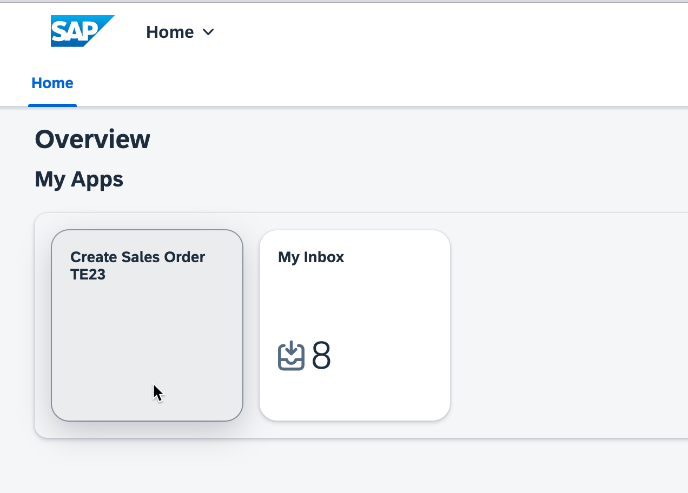
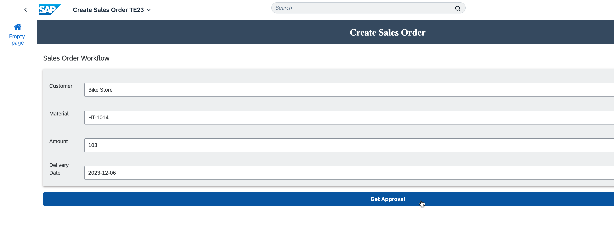
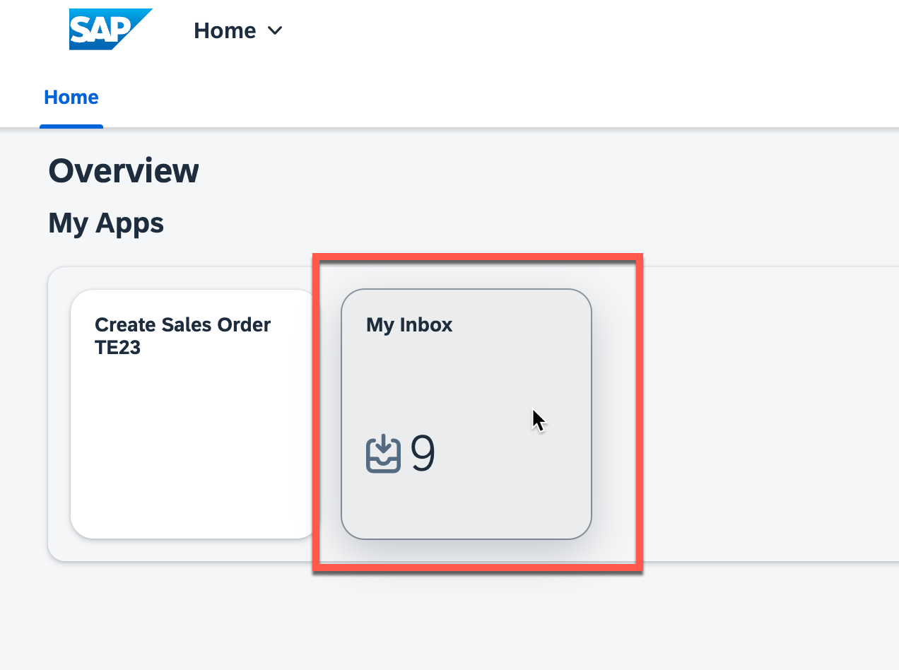
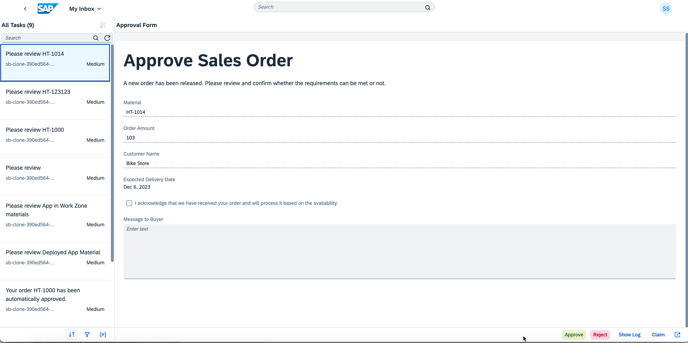

# Run the scenario

In this exercise, you will run the scenario end-to-end, including SAP Build Work Zone, SAP Build Apps and SAP Build Process Automation.

## Work on your tasks

1.	Open the app **Create Sales Order**
 

2. Maintain any data and select **Get Approval**.
    - Ensure your amount is above 100, to trigger the approval step.
    - Ensure you have used the right date format: YYYY-MM-DD

 

3. Go back and open the **My Inbox** app.

 

4. The new task is available for you with all the details you have entered before, either **Approve** or **Reject** it.

 

## Summary

Congratulations. You are now at the end of this exercise.
In case you want to learn more, please use these tutorials: 
- [SAP Build - a more advanced version of the exercises you have just done](https://developers.sap.com/mission.build-workshop-sales-order.html)

- [SAP Build Process Automation](https://developers.sap.com/tutorial-navigator.html?tag=software-product%3Atechnology-platform%2Fsap-build%2Fsap-build-process-automation)
- [SAP Build Work Zone, advanced edition](https://developers.sap.com/tutorial-navigator.html?tag=software-product%3Atechnology-platform%2Fsap-build%2Fsap-build-work-zone-advanced-edition)
- [SAP Build Work Zone, standard edition](https://developers.sap.com/tutorial-navigator.html?tag=software-product%3Atechnology-platform%2Fsap-build%2Fsap-build-work-zone-standard-edition)
- [SAP Build Apps](https://developers.sap.com/tutorial-navigator.html?tag=software-product%3Atechnology-platform%2Fsap-build%2Fsap-build-apps-enterprise-edition)
